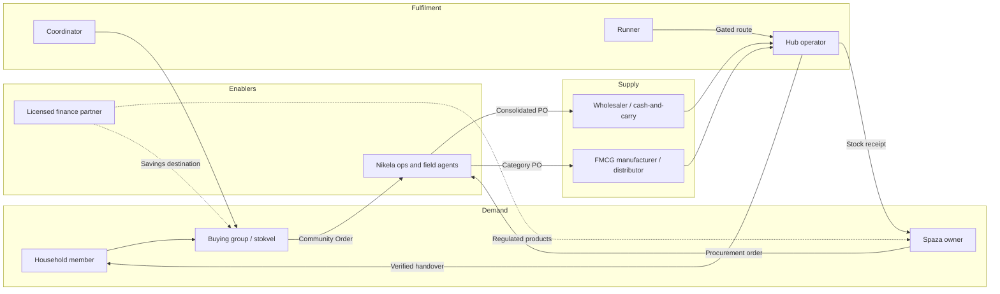

# 01 — Vision, Scope and Design Principles

## 1. What Nikela-OS Is

Nikela-OS is a **community procurement and distribution operating system**. It orchestrates existing community assets — collective purchasing power, trusted spaza shops, people already travelling, and stokvel savings culture — into a lower-cost, more inclusive commerce network.

It merges three connected systems into one platform:

1. **Community buying** — households and spaza shops aggregate demand into larger, more predictable orders that unlock supplier price tiers.
2. **Community selling** — spaza owners, coordinators, and trusted local institutions become procurement partners, hubs, and StockShare nodes.
3. **Community delivery** — verified runners and hubs move goods through scheduled, consolidated, economically gated routes.

The formalised behaviour underneath is **ukunikela**: asking a trusted person to shop, collect, or deliver on one's behalf. Nikela-OS turns that behaviour into verified roles, priced routes, proof of handover, and fair, transparent rewards.

## 2. What Nikela-OS Is Not

These exclusions are load-bearing. They shape the architecture as much as the features do.

| Not this | Because | Design consequence |
|---|---|---|
| A grocery retailer or courier competing with spazas | Non-disintermediation is a core partnership principle; spazas are the distribution backbone | No Nikela-owned consumer storefront that bypasses hubs; catalogue and fulfilment always flow through partners and local nodes |
| A bank, lender, or custodian of funds | Regulated products belong to licensed partners; Nikela must not hold deposits or make credit decisions | Wallet is a **non-custodial allocation ledger**; funds sit with licensed partners; the ledger records state, not custody |
| A grant-payment or grant-control system | Households must retain full choice over public grants | No grant integration; no targeting by grant status; demand signals never expose vulnerability profiles |
| A multi-level marketing scheme | CPA s43(4) prohibits compensation driven primarily by recruitment | Compensation engine structurally cannot pay more than one referral tier; all rewards key off verified product movement and operational events |
| A rapid on-demand delivery app | R37–R50 rapid-retail fees are integrated-retailer economics, not independent-route economics | Routes are released only when density gates clear; hub collection is the default service tier |

## 3. Actors and Their Journeys

Participants move fluidly across roles over time. The identity model (see `03-domain-model.md`) therefore separates the **person/organisation** from the **roles** they hold.

### Primary journeys

- **Spaza procurement (the wedge)**: owner sends a stock list on WhatsApp → Nikela parses it into a draft order → shows landed-cost comparison → owner confirms → order is pooled into a consolidated PO → goods delivered to shop or hub → invoice and verified saving reconciled.
- **Household community order**: member joins a buying group → builds a basket against a group cycle → group reaches a supplier price tier → order locked and prepaid → fulfilled to a hub → member collects with PIN/QR → verified saving allocated per member choice.
- **Runner route**: runner declares an existing trip (time, origin, destination, capacity) → engine matches open fulfilment tasks along the route → route released only when the density gate clears → runner completes verified handovers → rewards computed from the payout stack.
- **Hub operations**: hub receives and scans consolidated stock → separates orders → notifies collectors → verifies each handover → reconciles uncollected/damaged/substituted goods → earns per-successful-handover fees.

## 4. Design Principles

Every module specification cites these principles by number.

1. **One backend, one order identity.** A single procurement backend and a canonical order ID exist before any second front end. WhatsApp, the app, invoices, and partner systems all reference the same record.
2. **WhatsApp earns the first order; the app earns the operating system.** WhatsApp Business is the conversion and support layer. The Android app is unlocked by behavioural milestones (three cycles in 60 days plus 30 recurring SKUs, or volume/hub triggers), never forced.
3. **Density before delivery.** Routes are gated on successful-handover economics. Hub collection is the default tier; doorstep delivery is earned where density is proven. The platform optimises successful handovers per paid trip, not registrations or orders created.
4. **Transparent economics, always.** Retail comparator, supplier price, logistics fee, hub fee, platform fee, and final saving are shown before confirmation and proven after reconciliation. No fee is hidden in product price.
5. **Rewards follow verified operations.** Every payout keys off a verifiable event: a completed order, a scanned receipt, a PIN-confirmed handover. Referral rewards are capped at one tier and pay only after the referred participant completes genuine orders.
6. **Non-custodial by construction.** Nikela records allocations and settlement state; licensed partners hold funds and own regulated products. The ledger is double-entry and auditable but never a deposit account.
7. **Offline-tolerant, low-data, Android-first.** Every workflow must survive load-shedding and weak connectivity: queued actions, delayed sync, SMS/WhatsApp fallback, compressed assets, no mandatory video.
8. **Consent-based, minimal data.** POPIA governs all personal information. Aggregated insights (CPPI) are substantively de-identified with k-anonymity thresholds; individual purchasing history is never exposed to suppliers.
9. **Trust is layered, not assumed.** Community institutions anchor verification; the platform adds KYC tiers, device binding, chain-of-custody scans, reliability scores, and community-led dispute resolution before platform escalation.
10. **Earn complexity.** Ambient goods before cold chain. Wholesalers before manufacturer-direct. Operational value before finance referrals. Each capability has explicit entry criteria proven by pilot data.

## 5. Platform Scope by Module

| Module | Primary user | One-line scope |
|---|---|---|
| **StoreOnline** | Households, buying groups | Baskets, group cycles, savings visibility, collection/delivery tracking, stokvel allocations |
| **Nikela Procurement** | Spaza owners, coordinators | Consolidated ordering, supplier comparison, MOQ tiers, invoices, reorder templates |
| **Nikela Hubs** | Hub operators | Receiving, scan-in/out, storage windows, handover verification, reconciliation |
| **Nikela Runners** | Runners | Trip declaration, route offers, capacity matching, proof of delivery, earnings |
| **Nikela StockShare** | Spazas | Stock-out matching and short-radius inventory transfer between shops |
| **Wallet / Savings Ledger** | Members, groups, runners | Non-custodial allocation ledger, savings buckets, reward statements |
| **CPPI** | Suppliers, partners | Privacy-preserving Community Purchasing Power Index: demand, savings potential, seasonality |
| **Channels** | All external users | WhatsApp conversation engine, SMS fallback, notification orchestration |
| **Ops Console** | Nikela staff | Catalogue, pricing, order desk, route control, disputes, reconciliation, compliance |
| **Partner Portal** | Suppliers, finance partners | Purchase orders, fulfilment status, campaign management, pilot scorecards |

## 6. Success Criteria

The platform is proven when three things are simultaneously true, per the business thesis:

1. **Lower landed cost** — verified savings for spazas and households after all fees.
2. **Positive route economics** — the share of routes profitable without subsidy grows toward 100%; cost per successful handover clears the calculated floor.
3. **Retained community trust** — transparency, choice, reliability score integrity, and low dispute/shrinkage rates.

These map to concrete platform metrics wired in from day one (see `09-delivery-roadmap.md`).
