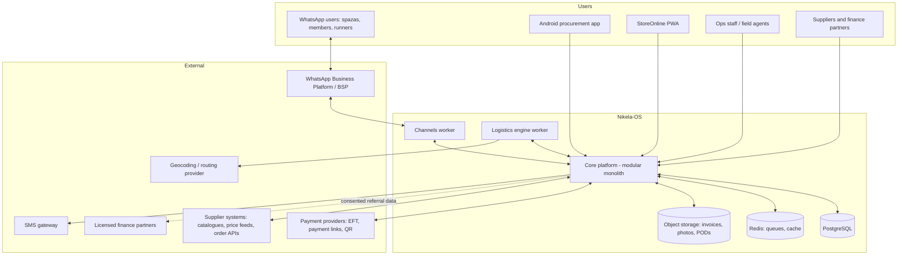
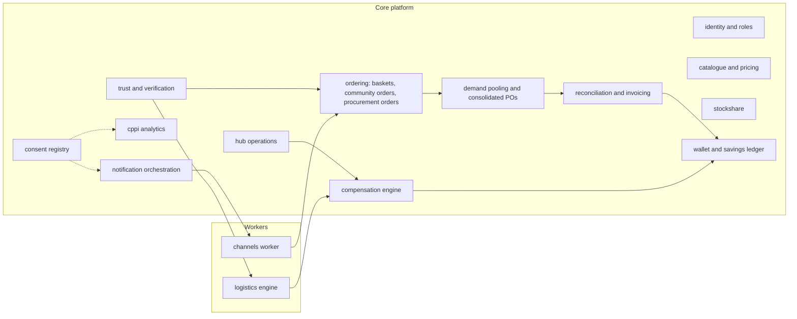
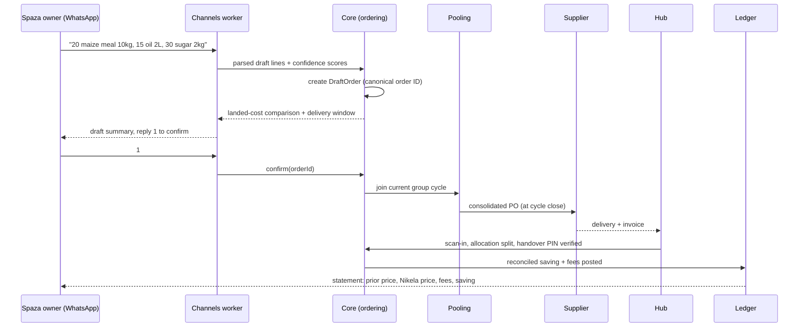

# 02 — System Architecture

## 1. Architectural Style

Nikela-OS starts as a **modular monolith with two satellite workers**, deployed as containers, and evolves toward service extraction only when scale demands it. This honours Principle 1 (one backend, one order identity) and Principle 10 (earn complexity): a pilot serving 10–20 spazas and 20–50 households does not need a microservice mesh, but it does need module boundaries strict enough that extraction later is a deployment change, not a rewrite.

Rules that keep the monolith modular:

- Modules communicate through **domain events** and exported service interfaces, never by reaching into each other's tables.
- Every state change that other modules care about is written to an **outbox table** in the same transaction, then relayed to the event bus. No dual writes.
- The **ledger** and **compensation** modules are append-only consumers of verified events; they never mutate operational state.

## 2. System Context



## 3. Module Decomposition

The core platform is one deployable unit containing bounded modules. The channels worker and logistics engine run as separate processes from day one because their workloads differ (long-polling webhooks and NLP inference; batch optimisation and geo queries).



| Module | Responsibility | Key invariant |
|---|---|---|
| `identity` | Persons, organisations, role grants, KYC tiers, device binding | One person, many roles; roles carry permissions and milestones |
| `catalogue` | SKUs, pack sizes, barcodes, supplier price tiers, substitution rules | Landed cost is computable per SKU per region per supplier |
| `ordering` | Baskets, draft orders, confirmation, canonical order IDs | No order exists without explicit confirmation (Principle 4); one order ID across all channels |
| `pooling` | Group cycles, tier thresholds, consolidated purchase orders | A consolidated PO always decomposes losslessly back to member/shop allocations |
| `hub-ops` | Receiving scans, storage windows, handover verification, shrinkage | Chain of custody is unbroken from PO receipt to handover proof |
| `stockshare` | Surplus/deficit matching between nearby shops, transfer workflow | Transfers only between verified shops within radius and stock-value caps |
| `ledger` | Double-entry non-custodial allocation ledger | Every entry balances; every entry references a verified source event |
| `compensation` | Runner/hub/coordinator payout stacks, one-tier referral rewards | Structurally incapable of multi-tier recruitment payouts (Principle 5) |
| `trust` | Reliability scores, endorsements, disputes, no-go constraints | Scores derive only from recorded operational events |
| `cppi` | Aggregation pipelines, k-anonymity enforcement, partner exports | No output row below the k-threshold; no individual-level exports |
| `notifications` | Template rendering, channel selection (WhatsApp/SMS/push), quiet hours | Every outbound message maps to a consent record |
| `consent` | POPIA consent capture, purpose binding, opt-out registry | Processing without a matching consent purpose is rejected at the API layer |
| `reconciliation` | Supplier invoices, credit notes, savings computation, statements | Verified saving = comparator − (supplier + logistics + hub + platform fees), computed only after final invoice |
| `channels` (worker) | WhatsApp/SMS webhooks, conversation state machine, media parsing, agent handoff | Free text never auto-places an order; drafts require explicit confirmation |
| `logistics` (worker) | Trip declarations, task matching, route gating, release, tracking | A route is never released below its density gate (Principle 3) |

## 4. Technology Stack

Choices align with the organisation's existing standards (TypeScript, Bun, Turborepo) and the operating environment (Android-heavy, low-data, load-shedding).

| Layer | Choice | Rationale |
|---|---|---|
| Language | TypeScript end-to-end | One language across backend, web, app, and shared domain packages; type-safe domain model shared via workspace packages |
| Runtime | Bun | Existing house standard; fast cold starts for workers |
| Monorepo | Turborepo + Bun workspaces | Existing house standard |
| Core API | Hono (HTTP) + tRPC for first-party clients, REST + webhooks for partners | Lightweight, edge-portable, typed client contracts for app/PWA; plain REST where partners integrate |
| Database | PostgreSQL 16 + Drizzle ORM | House standard; strong transactional guarantees for ledger and outbox; PostGIS extension for geo queries |
| Queue / cache | Redis + BullMQ | Scheduled jobs (group cycle closes, route gates, reconciliation runs), webhook fan-out, rate limiting |
| Realtime | Socket.io (ops console live order desk, route tracking) | House standard |
| Web apps | Next.js (App Router): Ops Console, Partner Portal, StoreOnline PWA | House standard; PWA gives StoreOnline installability without app-store friction |
| Android app | React Native (Expo), offline-first | Shares TypeScript domain package; Android-first per channel strategy |
| WhatsApp | Meta WhatsApp Business Platform via a BSP | Template messages, interactive buttons/lists, media ingestion |
| Media parsing | Speech-to-text + vision model behind an internal parsing service, human-in-the-loop | Voice notes and shelf/invoice photos become structured draft SKU lines with confidence scores; low-confidence lines route to agents |
| Object storage | S3-compatible | Invoices, proof-of-delivery photos, receipts, media |
| Geo | PostGIS + OSRM/Valhalla self-hosted or provider API | Route distance/detour computation for the logistics engine |
| Observability | OpenTelemetry, structured `logger.*` (no `console.log`), Sentry | Route economics and reconciliation need auditable traces |
| Deployment | Docker Compose (pilot) → Kubernetes + Helm (scale) | Mirrors existing repo deployment pattern |
| Region | af-south-1 (Cape Town) or equivalent ZA region | Data residency, latency to ZA users |

## 5. Monorepo Layout

```text
nikela-os/
├── apps/
│   ├── core/               # Hono API + tRPC routers, module code, outbox relay
│   ├── ops/                # Next.js Ops Console (order desk, route control, disputes)
│   ├── partner/            # Next.js Partner Portal (suppliers, finance partners)
│   ├── storeonline/        # Next.js PWA for households and buying groups
│   ├── procure-app/        # Expo Android app (unlocked at milestone, Phase 4+)
│   ├── channels/           # Channels worker: WhatsApp/SMS webhooks, conversation engine
│   └── logistics/          # Logistics engine worker: matching, gating, tracking
├── packages/
│   ├── db/                 # Drizzle schema, migrations, seed
│   ├── domain/             # Shared domain types, state machines, zod schemas
│   ├── ledger/             # Double-entry primitives, posting rules, statement builders
│   ├── economics/          # Route floor, payout stack, savings-split pure functions
│   ├── ui/                 # Shared UI components (web)
│   └── config/             # Env parsing, feature flags, logger
├── docker/
├── helm/
└── design/nikela-os/       # This package
```

`packages/economics` deserves emphasis: every formula in `05-logistics-route-economics.md` and `06-payments-wallet-finance.md` is implemented once as pure, unit-tested functions consumed by the logistics engine, compensation module, and reconciliation module. Pricing logic is never duplicated in a front end.

## 6. Data Flow: One Order, Many Channels

The canonical flow that Principle 1 protects:



The same `orderId` appears in the WhatsApp thread, the app, the invoice PDF, the hub scan, the supplier PO line allocation, and the ledger posting.

## 7. Offline, Low-Data, and Resilience Strategy

Per Principle 7, resilience is a first-class architectural concern, not a retrofit:

- **Client action queue.** The Android app and PWA queue mutations locally (IndexedDB / SQLite) with client-generated idempotency keys, and sync when connectivity returns. The server deduplicates on the idempotency key; conflicts resolve server-side with explicit user-visible outcomes (e.g. "cycle closed before your change synced — order held for next cycle").
- **Channel fallback ladder.** Push → WhatsApp → SMS. Notification orchestration picks the cheapest channel that meets the urgency class; delivery-critical messages (handover PINs, route confirmations) always have an SMS fallback.
- **Load-shedding tolerance.** All scheduled jobs are idempotent and resumable; group-cycle closes and route gates re-evaluate on retry rather than assuming a single execution.
- **Data budget.** Catalogue images are compressed and versioned; the app ships a modular install (base < 25 MB target); no autoplay media; delta sync for catalogue updates.
- **Degraded-mode ops.** The Ops Console order desk lets field agents act on behalf of users end-to-end, so a fully manual WhatsApp + human pipeline can run the pilot even if client apps are unavailable.

## 8. Deployment Topology

Pilot (single region, Docker Compose or small k8s):

- `core` (2 replicas), `channels` (2), `logistics` (1), Postgres (primary + PITR backups), Redis, object storage, OSRM.
- Everything stateless except Postgres/Redis/objects; horizontal scale-out is per-worker.

Scale-up triggers and responses:

| Trigger | Response |
|---|---|
| WhatsApp webhook volume saturates channels workers | Scale channels horizontally; move media parsing to its own worker pool |
| Route optimisation latency grows with node count | Extract logistics engine's matcher into a dedicated service with its own read replica |
| CPPI aggregation contends with OLTP | Add a read replica / move analytics to a warehouse (e.g. ClickHouse) fed by the event stream |
| Multi-region clusters | Region-partition pooling and logistics by operating zone; core stays single-region until data-residency or latency demands otherwise |

## 9. Cross-Cutting Concerns

- **Idempotency everywhere.** Webhooks (BSP, payments, suppliers) and client mutations all carry idempotency keys; processing is exactly-once from the domain's perspective.
- **Money as integers.** All amounts are stored in cents (ZAR) as integers. Percentages and splits are computed with explicit rounding rules defined in `packages/economics` and reconciled to the cent.
- **Time and zones.** All timestamps UTC in storage; operating zones carry their own service windows and quiet hours.
- **Feature flags.** Capability gates (cold chain, doorstep tier, StockShare, finance referral) are flags evaluated against entry criteria, mirroring Principle 10.
- **Auditability.** Every state transition on orders, routes, handovers, and ledger entries records actor, channel, timestamp, and prior state — required for disputes, insurance claims, and partner scorecards.
