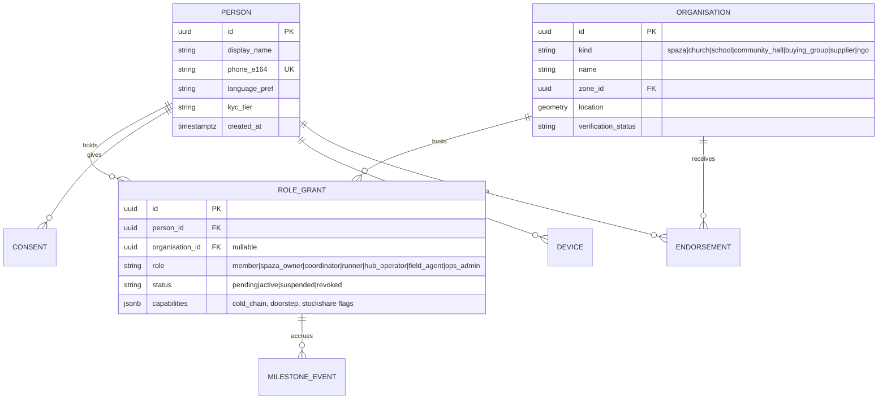
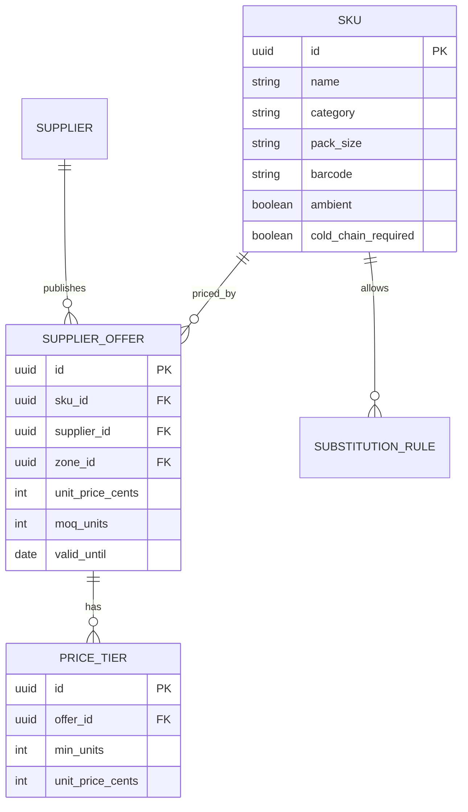
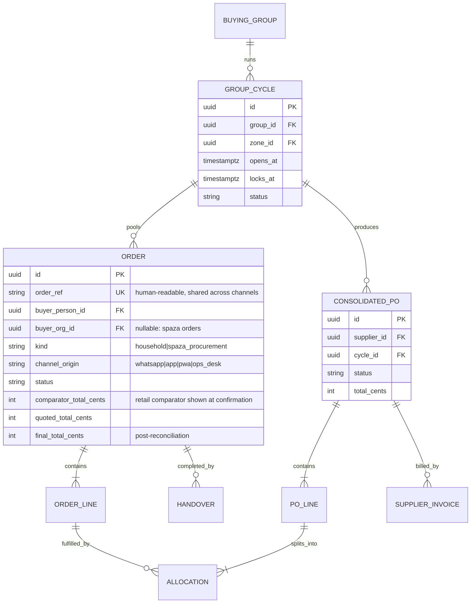
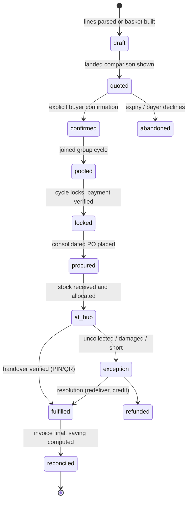
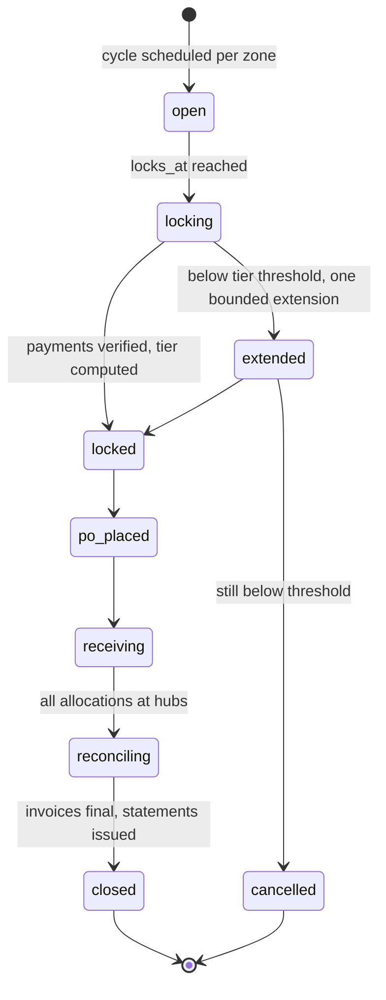
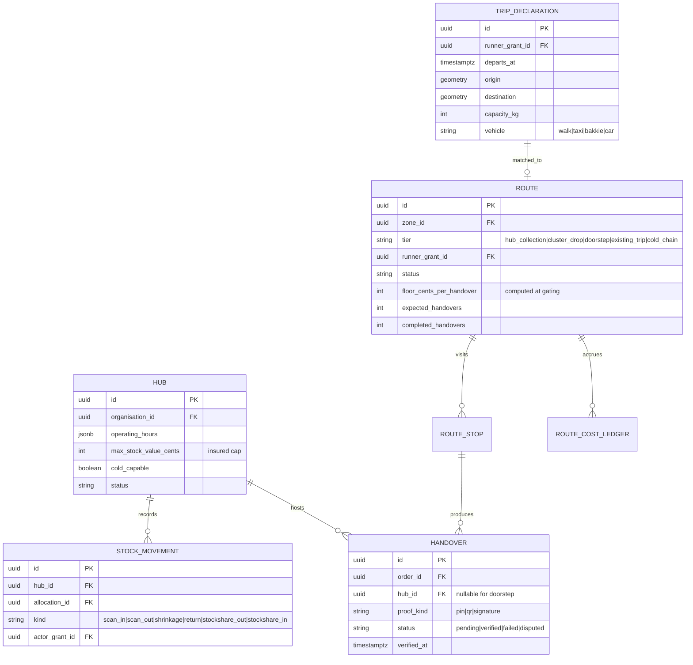
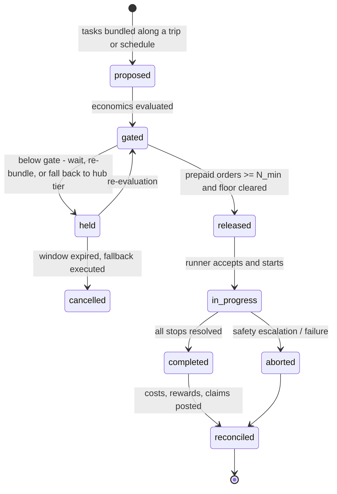
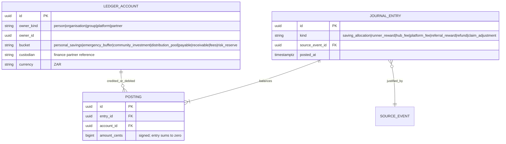
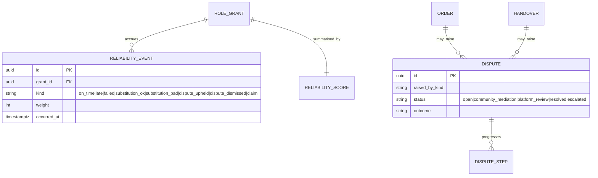
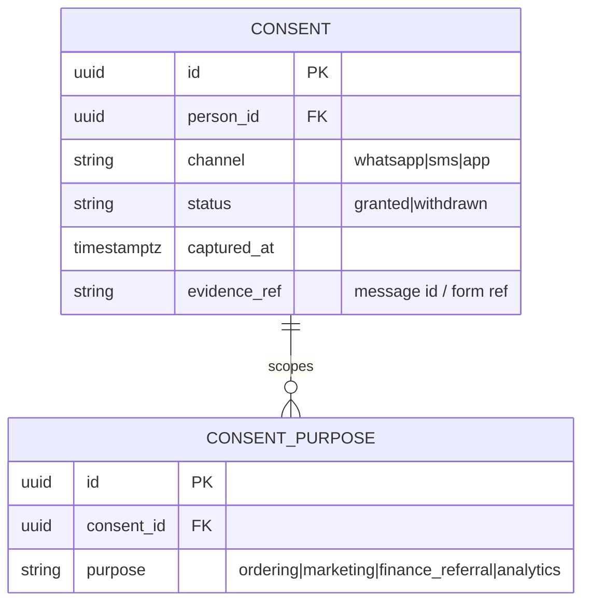

# 03 — Domain Model

## 1. Identity: People, Organisations, Roles

A person is one record with many roles (Principle: buyer today, runner tomorrow, hub operator next year). Roles carry their own verification tier, milestones, and permissions. Organisations (spaza shops, churches, schools, buying groups, suppliers) are separate entities linked to people through role grants.

- `kyc_tier` steps: `t0_phone` (phone-verified) → `t1_identity` (ID document) → `t2_enhanced` (runners, hub operators: ID + institutional endorsement + address). Capabilities like cold-chain routes require the tier named in their entry criteria.
- `ENDORSEMENT` records institution-backed vouching (church, stokvel, NASASA affiliate, established spaza), feeding the trust graph.

## 2. Catalogue and Pricing

- **Landed cost** per SKU per zone = tier unit price + allocated logistics + hub handling + platform fee. Computed by `packages/economics`; shown pre-confirmation (Principle 4).
- `SUBSTITUTION_RULE` encodes approved swaps (brand/pack) with a policy: `auto_allowed | ask_first | never`. Substitutions outside rules require explicit buyer approval via the channel.

## 3. Ordering and Pooling

The **canonical order** is the contract with a household member or spaza. The **group cycle** pools orders; the **consolidated PO** is the contract with a supplier. Allocation lines keep the decomposition lossless in both directions.

### Order lifecycle

Invariants:

- `draft → confirmed` never happens automatically from free text (channel rule).
- `pooled → locked` requires verified payment state (prepaid or approved settlement workflow) — routes and POs are never placed against unverified money.
- `reconciled` is the only state that triggers savings allocation and referral-reward eligibility.

### Group cycle lifecycle

## 4. Fulfilment: Hubs, Routes, Handovers

### Route lifecycle (density-gated)

The gate itself (thresholds, floor computation, fallbacks) is specified in `05-logistics-route-economics.md`. The state machine guarantees that `released` is unreachable without a passing gate evaluation recorded on the route row.

## 5. Ledger: Non-Custodial Double-Entry

The ledger records **allocations and obligations**, not custody. Funds live with licensed partners; each ledger account carries a `custodian` reference so statements can always say where real money sits (Principle 6).

Posting rules (implemented once in `packages/ledger`):

- Every `JOURNAL_ENTRY` must reference a verified `SOURCE_EVENT` (e.g. `order.reconciled`, `handover.verified`, `route.reconciled`). No manual free-form postings; ops adjustments are their own typed entry kind with mandatory reason and approver.
- Savings allocation on `order.reconciled` splits the verified saving across buckets **per the member's own allocation choice** (immediate discount / personal savings / voluntary stokvel allocation / split) captured at confirmation.
- The four community buckets (personal savings, emergency buffer, community investment, distribution pool) are governed by documented group rules; emergency/investment contributions must be voluntary flags on the member's split.
- Referral rewards post only on the referred participant's `order.reconciled`, are capped, and have exactly one beneficiary level — the schema has no parent-referrer chain to traverse.

## 6. Trust Graph

- `RELIABILITY_SCORE` is a decayed weighted sum recomputed from events — never manually edited. It feeds route eligibility, hub stock-value caps, app-milestone unlocks, and partner scorecards.
- Dispute flow honours community-led resolution: `open → community_mediation` (coordinator/institution mediates) before `platform_review`. Every step is recorded for pattern detection.

## 7. Consent and Data Governance Entities

- Outbound marketing and finance-referral data flows check `CONSENT_PURPOSE` at the API layer (Principle 8). Ordering-transactional messages ride on the ordering purpose.
- CPPI aggregation reads only zone/category/cycle rollups produced by a pipeline that enforces the k-anonymity threshold (see `07-security-privacy-compliance.md`).

## 8. Identifier and Reference Conventions

- All primary keys are UUIDv7 (time-ordered, index-friendly).
- `order_ref` is a short human-readable code (e.g. `NK-7F3K2`) safe to read over a phone call or WhatsApp voice note; it is the number printed on invoices and quoted in disputes.
- Handover PINs are single-use, scoped to one handover, delivered over the buyer's channel with SMS fallback, and never logged in plaintext.
