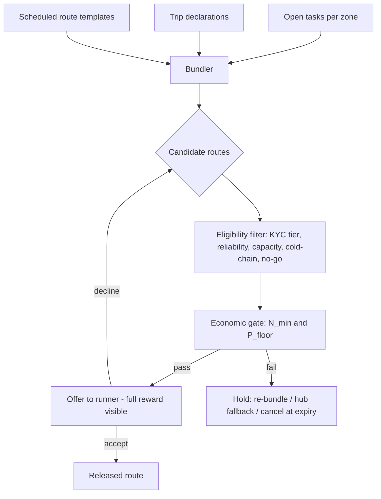

# 05 — Logistics and Route Economics

This document specifies the logistics engine: how demand becomes fulfilment tasks, how tasks become routes, and the economic gates that make Nikela's last mile profitable per successful handover rather than subsidised per order. All formulas live in `packages/economics` as pure, unit-tested functions.

## 1. Operating Rule: Density First

The engine optimises **successful handovers per paid trip**. The denominator of every unit-cost figure is verified handovers (`handover.verified`), never orders placed. A route with 12 promises and 7 completions bears the cost of 12 and the density of 7 — so the system is built to protect completion: prepayment, confirmed windows, PIN verification, and hub fallbacks.

## 2. Service Tiers

| Tier | Default use | Availability rule |
|---|---|---|
| **Hub collection** | Ambient goods; every new zone | Always available; the default for all orders |
| **Clustered neighbourhood drop** | Dense, repeatable local loops | Enabled per micro-zone after hub-tier history proves density |
| **Doorstep delivery** | Mobility-limited members; proven dense clusters | Earned tier: enabled only where handover history clears the doorstep floor; premium scheduled service |
| **Existing-trip runner** | Town trips, peri-urban and rural routes | Priced on incremental detour and capacity, not full trip cost |
| **Cold-chain route** | Perishables only | Restricted: certified runner + equipped hub + temperature SOP (see §8) |

Customer-facing pricing rule (from the profitability benchmarks):

- Calculated floor **below R37–R50** → may be marketed as a saving vs rapid-retail delivery.
- Floor **R37–R90** → viable as a scheduled convenience tier; must demonstrate total basket saving or avoided travel cost.
- Floor **above R90** → never presented as ordinary community delivery; reclassified as premium/exception or handed to a partner courier.

R37–R50 is a willingness-to-pay comparator, not a cost target.

## 3. Route Cost Ledger

Every route accrues a five-pool cost ledger; ratios are learned from pilot data per zone, never hard-coded from national averages:

```text
C_route = C_labour + C_fuel_vehicle + C_hub + C_risk + C_platform
```

| Pool | Includes |
|---|---|
| `C_labour` | Runner reward, shopping time, sorting, waiting/access delays, handovers, support minutes |
| `C_fuel_vehicle` | Incremental kilometres, fuel, parking, tolls, wear, depreciation |
| `C_hub` | Receiving, scan-in, sorting, storage window, security, collection handling |
| `C_risk` | Insurance reserve, claims history, security protocol cost, failed-delivery reserve |
| `C_platform` | Payments, routing, notifications, reconciliation, support — allocated per completed handover |

Labour and fuel/vehicle are the **protected pools**: no route is released unless both are covered by the route's revenue plan.

## 4. Gating Formulas

**Price floor per successful handover** (with target contribution margin `M_target`):

```text
P_floor = (C_labour + C_fuel_vehicle + C_hub + C_risk + C_platform) / N_successful_handovers + M_target
```

**Hub-handover variant** (town-to-hub trip amortised over collectors):

```text
P_hub_handover = (C_town_to_hub_route + C_hub_handling + C_risk + C_platform) / N_members_collecting
```

**Release gate** — minimum confirmed and prepaid orders before a route may leave `gated`:

```text
N_min = ceil( (C_runner + C_fuel_vehicle + C_hub + C_risk + C_platform) / P_available_per_handover )
```

Route acceptance gate (all must hold):

1. Confirmed **and prepaid** orders ≥ `N_min`.
2. Cargo weight/volume fits the runner's declared capacity and vehicle.
3. Delivery window and recipient/hub availability confirmed.
4. Expected price per successful handover clears `P_floor`.
5. A fallback exists: alternate runner, hub collection, reschedule, or refund.

Failed gates degrade gracefully: `held → re-bundle` (merge with adjacent tasks), `held → fall back to hub tier`, or `cancelled` with automatic prepayment release. Fallback execution is automatic at window expiry, not an ops afterthought.

## 5. Matching Engine

Inputs: open fulfilment tasks (order allocations needing movement), trip declarations, scheduled route templates (recurring town-to-hub runs), zone geometry, runner eligibility.



Design decisions:

- **Bundling heuristic first, optimisation later.** Pilot volumes (tens of stops per zone) need a greedy detour-minimising bundler with distance/time matrix from OSRM, not a full VRP solver. The interface is a pure function so a solver can replace the heuristic without touching the state machine.
- **Existing trips are priced on the detour.** For `existing_trip` tier, `C_fuel_vehicle` and `C_labour` count only documented incremental kilometres and minutes versus the runner's declared baseline trip — this is what distinguishes crowd logistics from courier work, and it is measured, not assumed.
- **Offers are honest.** The runner sees stops, weights, windows, and the full payout stack before accepting. Declines carry no penalty and feed no negative score.

## 6. Compensation (Payout Stacks)

Computed by the compensation module on `route.reconciled`, posted to the ledger with full breakdown (Principle 5).

**Runner:**

```text
R_runner = R_base + R_weight + R_incremental_distance + R_cluster + R_quality + R_risk
```

- `R_base`: accepted and completed verified route.
- `R_weight`, `R_incremental_distance`: documented incremental capacity/detour only.
- `R_cluster`: additional successful handovers after the route clears break-even density.
- `R_quality`: on-time, correct items, approved substitutions, POD compliance, low disputes.
- `R_risk`: policy-driven premium for approved difficult/high-risk routes (never self-declared).

**Distributor / coordinator:**

```text
R_distributor = R_coordination + R_successful_handovers + R_reliability + R_approved_risk − R_substantiated_claims
```

Claims adjustments require a substantiated claims process outcome and can never push a period's earnings negative (no punitive debt).

**Hub:** flat per-successful-handover or per-case handling fee per agreement; accrues only on `handover.verified`.

**Referral (capped, one tier):** a single reward per referred participant, paid on the referred participant's first `order.reconciled` events up to a cap, allocated into the referrer's savings ledger. The schema and code paths support exactly one beneficiary level.

## 7. Regional Playbooks

Encoded as per-zone configuration, not code branches:

| Route profile | Default fulfilment | Pricing | Controls |
|---|---|---|---|
| Dense urban cluster | Hub drop or clustered doorstep loop | Standard scheduled rate; density bonus past break-even | PIN proof, recipient windows, batching |
| Gated estate / business precinct | Hub/concierge or appointment delivery | Access premium; no generic free delivery | Pre-cleared access, wait-time rule, backup pickup point |
| Township / peri-urban node | Trusted hub + verified runner | Scheduled group-order price | Landmark addressing, daylight delivery, cash-light settlement |
| High-risk / night route | No default doorstep | Premium / partner courier / next window | Geofencing, escalation, restricted hours |
| Extended / isolated (e.g. long Cape routes) | Fixed delivery days, hub default | Zone-specific floor; no citywide promises | Per-cluster operating zones |

Zone config fields: service windows, no-go times/areas, risk premium class, doorstep-tier flag, cold-chain flag, comparator retailer set, cycle calendar.

## 8. Cold Chain (Restricted Path)

Launch is ambient-only. The cold-chain tier unlocks per zone only when all hold:

- At least one `cold_capable` hub with approved equipment (refrigerated container / modular cold room) and temperature monitoring.
- Certified runners: insulated equipment, training flag, maximum route-time policy.
- Temperature SOP: defined bands, loading/door-opening procedures, per-leg accountability, logged sensor readings attached to the route record.
- Spoilage reserve priced into the tier; claims and traceability process live.

A cold-chain incentive is never paid without the equipment, training, and compliance flags on the route record.

## 9. Addressing, Safety and Failure Handling

- **Landmark addressing**: free-text address + landmark + geo-pin captured at onboarding; hub-relative directions preferred over street addresses in townships. Address confidence feeds the failed-delivery reserve.
- **Safety**: daylight-first scheduling, no-go geofences and hours, one-tap escalation to ops with live location, cash-light protocol (prepaid default; no doorstep cash collection in high-risk zones).
- **Failed stop protocol**: recipient absent → immediate hub fallback (goods scanned into fallback hub, collector re-notified with new PIN); repeated failures shift the buyer's default tier to hub collection.
- **Chain of custody**: sealed bags, scan at every custody change, photo POD where PIN/QR is impossible; every leg has an accountable role grant.

## 10. Weekly Route Health Metrics

Reported per zone, feeding the roadmap's pilot gates:

| Metric | Use |
|---|---|
| Successful handovers per paid route | Density denominator |
| Runner labour minutes per successful handover | Labour efficiency |
| Incremental km and fuel/vehicle cost per route | Tests whether trips are genuinely pre-existing |
| Failed delivery/pickup rate | Hidden cost of incomplete stops |
| Hub sort time and pickup duration | True hub cost |
| Claims, loss, damage, security incidents | Actual risk reserve calibration |
| Share of routes clearing floor without subsidy | The headline viability metric |
| Distributor gross profit per route and per active buyer | Role credibility |
