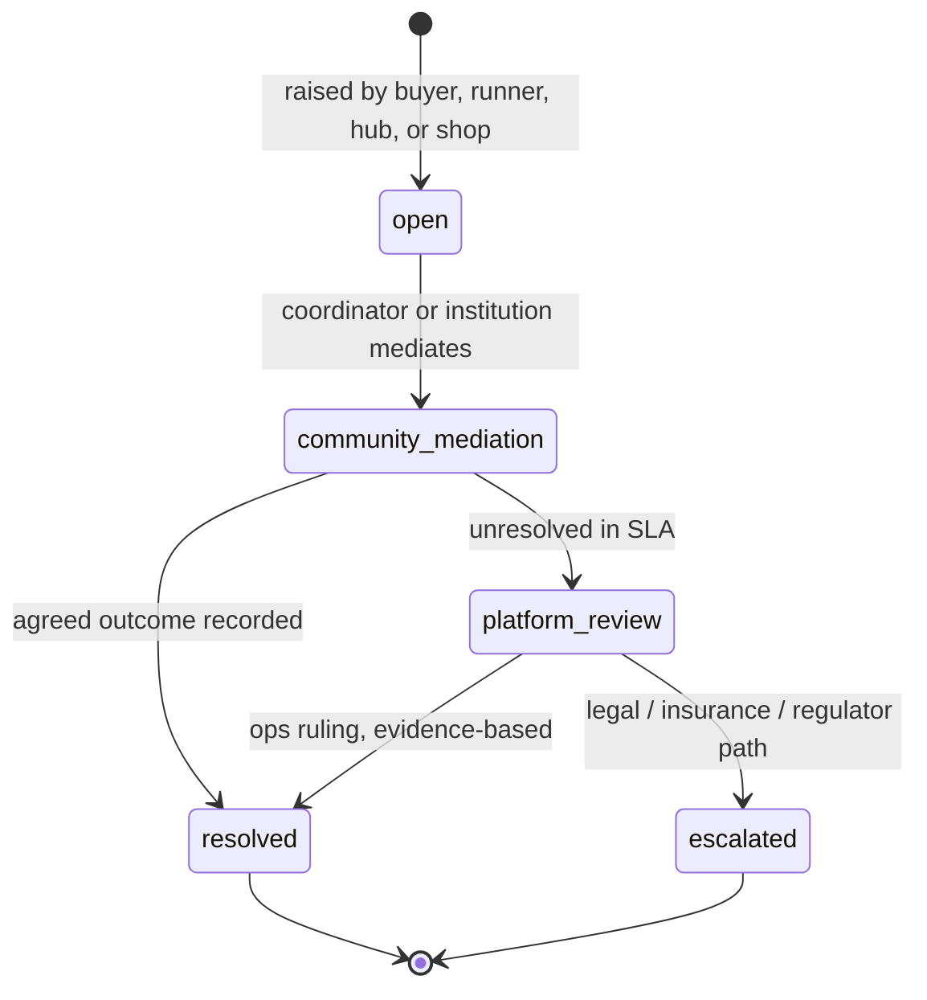

# 07 — Security, Privacy and Compliance

Compliance is designed in as structure, not policy documents: the schema, the compensation engine, and the API layer make the prohibited things unrepresentable and the required things automatic.

## 1. Regulatory Map → Platform Controls

| Regulation / risk | Requirement | Structural control in Nikela-OS |
|---|---|---|
| CPA s43(4) — pyramid schemes | Compensation must derive from real product movement, not recruitment | Compensation engine pays only on verified operational events; referral schema has exactly one beneficiary level with caps; no joining fees or mandatory stock purchases exist anywhere in the model |
| CPA / direct marketing | Opt-in/opt-out for promotional communication | `CONSENT_PURPOSE` checked at the notification API; opt-out honoured immediately; evidence reference stored per consent |
| POPIA | Lawful, minimal, purpose-bound processing of personal information | Consent registry with purpose binding; data minimisation reviews per module; retention schedules; data-subject request workflows in the compliance desk |
| NCA / Banks Act (stokvel posture) | Stokvel funds within documented group rules; no unlicensed deposit-taking or lending | Non-custodial ledger; licensed-partner custody; group constitution workflows; contribution-threshold monitoring alerts |
| Food safety / municipal permits | Safe handling, especially perishables | Cold-chain tier gated on equipment/training/SOP flags; hub agreements record permit obligations; ambient-first launch |
| Labour / contractor classification | Runners as independent operators with fair, transparent terms | Full reward visible pre-acceptance; decline without penalty; no exclusivity; earnings statements; insurance boundaries documented |
| Goods-in-transit / hub liability | Insurable, evidenced operations | Chain-of-custody scans, stock-value caps, claims workflows with evidence, incident logs feeding broker reporting |
| Competition law | No resale-price maintenance, no anticompetitive exclusivity | Multi-supplier cycles with logged deterministic selection; StockShare does not set resale prices; no exclusivity clauses in partner templates |

## 2. POPIA Data Governance

### Data inventory and minimisation

| Data class | Examples | Rules |
|---|---|---|
| Identity | Name, phone, ID document (KYC t1+) | Encrypted at rest; ID documents in restricted object-storage bucket; access via compliance-desk permission only |
| Transactional | Orders, invoices, settlements, handovers | Core operational data; retained per statutory financial retention periods |
| Location | Hub/shop geo, delivery pins, runner track during active route | Runner tracking only while route `in_progress`, disclosed, retained 90 days then reduced to route-level aggregates |
| Media | Voice notes, invoice/shelf photos, PODs | Retention schedule (e.g. 180 days post-reconciliation unless attached to open dispute/claim); provenance links kept |
| Sensitive-by-inference | Anything revealing grant status, vulnerability | Never collected, never derived into any stored field or export |

### Consent lifecycle

1. Capture at first contact (WhatsApp opt-in message, form, or field-agent assisted) with evidence reference.
2. Purposes bound explicitly: `ordering`, `marketing`, `finance_referral`, `analytics`. Transactional messages ride on `ordering`.
3. Withdrawal honoured immediately; withdrawal cascades (e.g. `finance_referral` withdrawal blocks future packets, does not recall lawful past shares — this is disclosed).
4. Data-subject requests (access, correction, deletion) run through compliance-desk workflows with statutory clocks; deletion respects financial-record retention obligations via pseudonymisation rather than destruction where records must persist.

### CPPI de-identification (substantive, not cosmetic)

- Aggregation cells: zone × category × period. Cells with fewer than **k = 20 distinct buyers** are suppressed or merged into the parent zone/category.
- No export contains person/shop identifiers, exact locations (zone centroids only), or basket-level records.
- Release checklist includes a re-identification review (small-cell scan, differencing attack check against prior releases).
- Export log: recipient, purpose, contract reference, row counts, checksum.

## 3. Trust and Verification Architecture

### KYC tiers

| Tier | Verification | Enables |
|---|---|---|
| `t0_phone` | Phone possession (OTP) | Browsing, joining a group, drafting orders |
| `t1_identity` | ID document + selfie match | Confirming orders above value threshold, receiving savings allocations |
| `t2_enhanced` | t1 + institutional endorsement + address/premises check | Runner, hub operator, coordinator roles; StockShare |

### Trust graph in operation

- Reliability score: decayed weighted sum over recorded operational events only (on-time, failures, disputes, claims). No manual edits; ops can annotate, never adjust the number.
- Endorsements from verified institutions (churches, stokvels, burial societies, NASASA affiliates, established spazas) are recorded entities with their own verification status — community trust is an input, not a substitute for KYC where regulation requires it.
- Scores gate: route tiers, hub stock caps, StockShare value caps, app-milestone features. Gates are transparent to the user ("what unlocks next and why").

### Dispute resolution ladder

Outcomes feed reliability events symmetrically (upheld vs dismissed) so the dispute system cannot be weaponised.

## 4. Application and Infrastructure Security

- **AuthN**: phone-OTP primary; PIN + device binding for financially sensitive actions; WebAuthn/passkeys for ops and partner users; session revocation on device change.
- **AuthZ**: role-grant-based RBAC evaluated centrally; per-shop roles (owner/buyer/cashier/accountant) scoped to the organisation; ops permissions segregated (reconciliation vs adjustment vs payout approval).
- **Secrets and keys**: managed secrets store; provider webhook signature verification mandatory; handover PINs hashed at rest, single-use, short TTL.
- **Transport and storage**: TLS everywhere; AES-256 at rest; field-level encryption for ID numbers; ZA-region data residency.
- **Least-privilege data access**: agent console shows the minimum context for the task (e.g. an agent resolving a delivery sees the order, not the member's full history); every sensitive read is logged.
- **Abuse resistance**: rate limits per channel identity; duplicate-account heuristics (phone, device, graph proximity); referral-fraud velocity rules; WhatsApp webhook replay protection.
- **Availability**: idempotent consumers, dead-letter queues with ops visibility, Postgres PITR, restore drills; degraded-mode ops desk keeps the pilot running through outages.
- **Audit**: append-only audit trail of state transitions (actor, channel, prior state, timestamp) across orders, routes, handovers, ledger, consent — the substrate for disputes, claims, partner scorecards, and regulator queries.

## 5. Safety (Physical) Controls

- Zone config encodes no-go areas/hours; the gate refuses routes violating them.
- Daylight-first scheduling defaults; night routes require the premium/exception tier and ops approval.
- One-tap escalation with live location during active routes; incident log with severity taxonomy feeding zone risk premiums.
- Cash-light protocol: prepaid default, no doorstep cash in high-risk zones, documented handling where cash is unavoidable.

## 6. Compliance Desk (Operational Ownership)

A named internal function with tooling in the Ops Console:

- Consent registry queries and DSR workflows with statutory clocks.
- Referral-reward audit reports (distribution of rewards vs product movement — the CPA evidence pack).
- Stokvel contribution-threshold monitoring and NASASA affiliation records.
- CPPI release approvals and export logs.
- Claims/insurance reporting packs; incident registers.
- Quarterly legal-review checklist covering the regulatory map above, with regulator-facing documentation generated from live system data rather than manual spreadsheets.
