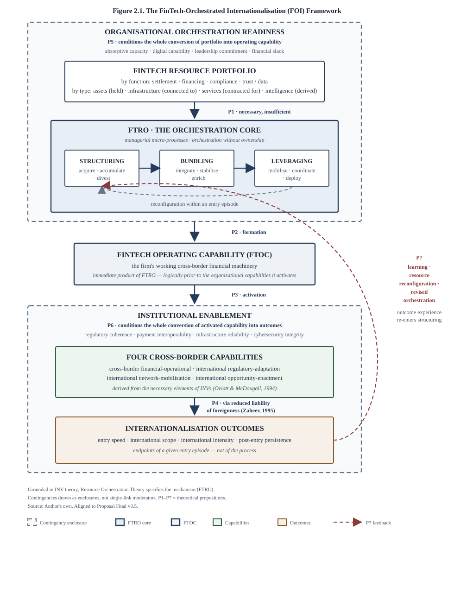

# FinTech-Orchestrated Internationalisation:
**How African Technology-Enabled Service SMEs Convert Digital Financial Resources into Cross-Border Capabilities**

**Student number:** 24126196
**Student name:** Linda Futwa

> A research project submitted to the Gordon Institute of Business Science, University of Pretoria, in partial fulfilment of the requirements for the degree of Master of Philosophy in International Business.

26 May 2025
*(Revised theoretical and methodological upgrade, July 2026 — v3.5)*

---

### Abstract

This proposal outlines an embedded qualitative multiple-case study examining how technology-enabled service SMEs in Kenya, Nigeria and South Africa convert FinTech resources into internationalisation capabilities. Existing research often associates FinTech or digitalisation with improved financing access, firm performance or international expansion, yet leaves the firm-level organisational mechanism through which heterogeneous digital financial resources become cross-border capabilities largely unspecified. Addressing this capability-generation gap, the study develops the FinTech-Orchestrated Internationalisation (FOI) Framework. Grounded in International New Venture (INV) theory and drawing on Resource Orchestration Theory to specify the mechanism, the framework proposes that competitive advantage arises not from FinTech adoption alone, but from FinTech Resource Orchestration (FTRO): the managerial processes of structuring, bundling and leveraging complementary FinTech resources. These processes are theorised to form a FinTech operating capability that activates four cross-border capabilities—financial-operational, regulatory-adaptation, network-mobilisation and opportunity-enactment—derived from the necessary elements of international new ventures. These in turn shape the speed, scope, intensity and persistence of internationalisation under organisational and institutional contingencies, with outcome experience feeding back into subsequent orchestration. SMEs constitute the primary cases. FinTech providers and financial regulators serve as embedded informants who illuminate resource affordances and institutional conditions. Evidence will be analysed through abductive template analysis and cross-case pattern matching. The study contributes by specifying FTRO as a mechanism linking FinTech resources to INV-informed internationalisation capabilities in African emerging-market contexts.

### Keywords

FinTech; Resource Orchestration; International New Ventures; SME Internationalisation; African Emerging Markets; Capability Generation

### Declaration

I declare that this research project is my own work. It is submitted in partial fulfilment of the requirements for the degree of Master of Philosophy in International Business at the Gordon Institute of Business Science, University of Pretoria. It has not been submitted before for any degree or examination at any other university. I further declare that I have obtained the necessary authorisation and consent to carry out this research.

_______________________
Name & Surname Signature

### List of Appendices

- Appendix 1: Consistency Matrix
- Appendix 2: Theory-Linked Interview Guides (SME, FinTech Provider, Regulator)
- Appendix 3: Draft Informed Consent Form
- Appendix 4: Research Project Plan

### Table of Contents

- Abstract
- Keywords
- Declaration
- List of Appendices
- Table of Contents
- Chapter 1. Introduction
  - 1.1 Opening Puzzle and Study Overview
  - 1.2 Business Rationale
  - 1.3 Academic Problem and Theoretical Gap
  - 1.4 Research Questions and Aims
  - 1.5 Conceptual Definitions
  - 1.6 Scope and Delimitations
  - 1.7 Significance of the Study
  - 1.8 Dissertation Roadmap
- Chapter 2. Literature Review and Theoretical Framework
  - 2.1 Conceptual Roadmap: The FOI Framework
  - 2.2 SME Internationalisation and INV Theory
  - 2.3 FinTech as a Strategic Resource Portfolio
  - 2.4 Resource Orchestration Theory and FTRO
  - 2.5 Capability Activation and Internationalisation Outcomes
  - 2.6 Organisational and Institutional Contingencies
  - 2.7 Capability-Generation Gap and Theoretical Propositions
  - 2.8 Theoretical Contribution of the Chapter
- Chapter 3. Research Methodology and Design
  - 3.1 Research Philosophy and Logic of Inquiry
  - 3.2 Research Design: Embedded Qualitative Multiple-Case Study
  - 3.3 Population, Sampling and Case Selection
  - 3.4 Data Collection Instruments and Procedures
  - 3.5 Data Analysis and Theory Development
  - 3.6 Rigour and Trustworthiness
  - 3.7 Ethical Considerations and Data Management
  - 3.8 Methodological Limitations
  - 3.9 Chapter Summary and Project Horizon
- References
- Appendices

---

## Chapter 1. Introduction

### 1.1 Opening Puzzle and Study Overview

African SMEs are widely recognised as central to employment and economic activity, yet their participation in international markets remains comparatively limited (International Finance Corporation [IFC], 2022; Organisation for Economic Co-operation and Development [OECD], 2021; World Economic Forum [WEF], 2022). At the same time, Africa has experienced rapid expansion of FinTech infrastructures—digital payments, alternative lending, compliance technologies and related platforms—that can reduce some of the financial frictions historically associated with cross-border commerce (IFC, 2023; McKinsey, 2023; Lee & Shin, 2018). More broadly, panel evidence shows that FinTech penetration drives financial development across emerging and developing economies, with the strongest effects precisely where financial-sector performance is weak and financial inclusion is low (Aduba, Asgari, & Izawa, 2023).

This coexistence of expanding digital financial access and persistent internationalisation constraints raises a theoretical puzzle. If FinTech availability were sufficient, firms with access to comparable digital financial tools should converge toward stronger internationalisation outcomes. They do not. The explanatory action therefore lies less in whether SMEs adopt FinTech than in how they orchestrate it.

**This study proposes the FinTech-Orchestrated Internationalisation (FOI) Framework to explain an emerging form of digitally enabled international entrepreneurship in which firms strategically structure, bundle and leverage digital financial resources to activate the capabilities required for rapid and sustained cross-border expansion.**

The study is empirically bounded to technology-enabled service SMEs in Kenya, Nigeria and South Africa and uses an embedded multiple-case design. SMEs constitute the primary cases. FinTech providers and financial regulators serve as embedded informants who illuminate resource affordances and institutional conditions.

### 1.2 Business Rationale

SME internationalisation is frequently constrained by limited access to finance, high transaction costs, fragmented payment systems, regulatory complexity and institutional weaknesses. These barriers are especially pronounced in early expansion, when firms must simultaneously establish foreign-market presence, build international relationships and manage cross-border financial risk with limited resources (IFC, 2022; OECD, 2021).

FinTech innovations have begun to reshape this landscape by providing alternatives to conventional banking channels. Mobile payments and digital wallets can accelerate settlement; digital lending and invoice finance can ease liquidity constraints; RegTech can reduce onboarding and compliance frictions; and trust or data infrastructures can support more reliable exchange. For managers and policymakers, the practical question is therefore how SMEs can convert these tools into durable internationalisation capacity rather than isolated operational improvements.

This business rationale identifies the phenomenon. It does not, by itself, specify the academic contribution.

### 1.3 Academic Problem and Theoretical Gap

#### 1.3.1 Theoretical problem

International New Venture (INV) theory explains how some firms internationalise early by controlling unique resources, relying on alternative governance structures and coordinating activities across borders (Oviatt & McDougall, 1994; Zahra, 2005). Born-global research emphasises innovative culture and organisational capabilities as foundations of early internationalisation (Knight & Cavusgil, 2004). Network research shows that relationships are central to opportunity identification, credibility and resource access (Coviello, 2006).

Two recent contributions sharpen this opening. Rumyantseva and Welch (2023) revisited the firms underpinning the seminal born-global and INV studies and found that incumbent organisations were involved in founding many of them, with early internationalisation drawing substantially on resources accessed through those founding relationships. Their revisit implies a question it does not itself pursue: how do genuinely independent ventures—founded without an incumbent whose resources they can draw upon, as is typical of African SMEs—assemble the resource base that early internationalisation requires? Westerlund (2020), comparing internationally oriented online SMEs with domestically oriented peers in a Canadian sample, documents systematic differences in information systems, value networks, internal ICT resources and cyber resilience, and observes that the mechanisms of digitally enabled scaling remain little known. That such capability profiles must therefore be *formed* somehow is our inference, not his claim. The first contribution exposes a provenance problem; the second, a formation problem. FinTech Resource Orchestration addresses both: capabilities need not be inherited when they can be assembled by orchestrating externally provided digital financial resources—orchestration without ownership.

Separately, FinTech scholarship shows that digital financial technologies reshape ecosystems and business models (Lee & Shin, 2018; Gomber, Koch, & Siering, 2017) and can improve SME financing access under certain institutional conditions (Abbasi, Alam, Brohi, Brohi, & Nasim, 2021). Digitalisation and platform research likewise links internet-based capabilities to export marketing and internationalisation, while also recognising platform risks (Jean & Kim, 2020; Jean, Kim, & Cavusgil, 2020). Reviews of SME internationalisation continue to treat finance, information technology and network ties as complementary but theoretically fragmented antecedents (Anwar, Li, Al-Omush, & Al-Nimer, 2023).

Adjacent work has begun to move beyond simple adoption–outcome associations. Quantitative studies show that digital platform capabilities and digital resilience can mediate digital-transformation outcomes for internationalising SMEs (Aghazadeh, Zandi, Amoozad Mahdiraji, & Sadraei, 2024), and that resource orchestration helps explain how digitalisation and internationalisation jointly shape firm performance (Bhandari, Zámborský, Ranta, & Salo, 2023). Systematic reviews similarly conclude that digitalisation and internationalisation are increasingly intertwined, yet call for clearer process accounts of how digital resources are configured in SME internationalisation (Bargoni, Ferraris, Vilamová, & Wan Hussain, 2024). These contributions are important, but they remain incomplete for the present purpose: they typically examine broad digitalisation or platform capabilities, manufacturing or multi-industry samples, and/or performance associations rather than reconstructing the firm-level process through which heterogeneous *FinTech* resources become the cross-border capabilities that INV theory associates with early internationalisation in African emerging-market service SMEs.

The unanswered theoretical question is therefore not whether FinTech or digital technologies are associated with internationalisation-related advantages. Rather:

> How do resource-constrained SMEs convert heterogeneous FinTech resources into the cross-border capabilities that INV theory associates with rapid internationalisation?

Existing studies predominantly examine associations between FinTech or digital technology adoption and financing, performance or internationalisation outcomes, or they model digitalisation at a more aggregate capability level. The organisational mechanism through which complementary FinTech resources are structured, bundled and leveraged into INV-informed internationalisation capabilities remains underspecified. This is the **capability-generation gap** addressed by the present study.

#### 1.3.2 Point of difference

Unlike studies that treat FinTech primarily as an external technological enabler or adoption variable, this study conceptualises FinTech-Orchestrated Internationalisation as a firm-level organisational process. The FOI Framework shifts analytical attention from *what FinTech does* to *how firms orchestrate it*. Its central construct is **FinTech Resource Orchestration (FTRO)**: the managerial process of structuring, bundling and leveraging complementary FinTech resources (Sirmon, Hitt, & Ireland, 2007; Sirmon, Hitt, Ireland, & Gilbert, 2011).

**Central theoretical proposition**

> FinTech does not directly accelerate internationalisation. Firms achieve accelerated and more durable internationalisation by orchestrating digital financial resources, thereby generating the cross-border capabilities required for rapid global expansion under organisational and institutional contingencies.

### 1.4 Research Questions and Aims

**Primary research question**

> How do African technology-enabled service SMEs orchestrate FinTech resources to develop the capabilities required for rapid and sustained internationalisation?

**Sub-questions**

- **RQ1:** How do these SMEs structure, bundle and leverage FinTech resources during internationalisation, and how do they reconfigure those arrangements as international experience accumulates?
- **RQ2:** What cross-border capabilities are generated through FinTech Resource Orchestration?
- **RQ3:** How do these capabilities shape the speed, scope, intensity and persistence of internationalisation?
- **RQ4:** How do organisational readiness and institutional conditions shape FinTech Resource Orchestration and its conversion into internationalisation outcomes?

**Research aims**

1. Reconstruct the FinTech resource portfolios and orchestration processes used by rapidly internationalising technology-enabled service SMEs in Kenya, Nigeria and South Africa.
2. Identify the FinTech operating capability and the cross-border capabilities generated through FTRO.
3. Explain how these capabilities relate to internationalisation outcomes.
4. Triangulate SME accounts with FinTech-provider and regulatory perspectives on resource affordances and institutional conditions.
5. Develop and refine the FOI Framework as a mechanism-based extension of INV theory through Resource Orchestration Theory.

### 1.5 Conceptual Definitions

- **FinTech-Orchestrated Internationalisation (FOI):** A mechanism-based framework explaining how SMEs convert complementary digital financial resources into cross-border internationalisation capabilities through purposeful orchestration under organisational and institutional contingencies. FOI is a capability-generation framework, not a technology-adoption or FinTech-maturity model.
- **FinTech Resource Orchestration (FTRO):** The firm-level managerial process of structuring, bundling and leveraging complementary FinTech resources to support cross-border activities. FTRO is the central mediating process in the FOI Framework, and is recursive: outcome experience feeds back into subsequent structuring.
- **FinTech operating capability (FTOC):** The immediate product of FTRO—a coherent, routinely deployable configuration of complementary FinTech resources through which the firm conducts cross-border business. The term is deliberately chosen: *operating* signals that this is the firm's working financial machinery rather than a strategic posture, and the construct is logically prior to, and distinct from, the four organisational capabilities it activates. The label is used here in a strict firm-level capability sense, not in the looser practitioner sense of a technology stack or "operating environment".
- **FinTech resource portfolio:** The set of complementary digital financial resources available to the firm across transaction and settlement, financing and liquidity, identity/compliance/risk, and trust/assurance/data-infrastructure domains.
- **Cross-border internationalisation capabilities:** Firm capacities activated through FTRO, comprising financial-operational, regulatory-adaptation, network-mobilisation and opportunity-enactment capabilities.
- **Embedded informants:** FinTech providers and regulators or closely related ecosystem actors whose accounts triangulate resource-side affordances and institutional conditions surrounding SME cases.

### 1.6 Scope and Delimitations

The study is delimited to:

- **Primary cases:** technology-enabled service SMEs (for example software development, digital marketing, e-commerce-enabled services and business process outsourcing);
- **Embedded informants:** FinTech providers and financial regulators or closely related ecosystem actors in the same country contexts;
- **Countries:** Kenya, Nigeria and South Africa, selected for FinTech ecosystem vibrancy and regulatory diversity;
- **Internationalisation profile:** SMEs with early or accelerated foreign-market activity, operationalised as meaningful international revenue, clients or partnerships within approximately three years of establishment, or clear rapid post-establishment international expansion;
- **Phenomenon:** FinTech orchestration for SME internationalisation, not FinTech-firm internationalisation or domestic FinTech adoption alone.

SMEs remain the theoretical unit of analysis for FTRO. Providers and regulators are included to triangulate resource-side and institutional contingencies, not to convert the study into an industry or policy evaluation. The study aims for analytical generalisation and theoretical refinement of the FOI Framework, not statistical generalisation to all African SMEs.

### 1.7 Significance of the Study

- **Theoretical significance:** Specifies FTRO as the missing organisational mechanism linking FinTech resources to INV-informed internationalisation capabilities, extending INV theory and, through it, Resource Orchestration Theory.
- **Managerial significance:** Offers SME decision-makers a process view of how to select, integrate and redeploy FinTech configurations for internationalisation rather than adopting tools piecemeal.
- **Provider and policy significance:** Clarifies how product design, interoperability and regulatory conditions enable or constrain firm-level orchestration.
- **Methodological significance:** Demonstrates how an embedded multiple-case design can examine firm-level mechanisms while triangulating supply-side and institutional evidence.

### 1.8 Dissertation Roadmap

| Chapter | Role | Contribution to FOI |
|---|---|---|
| Chapter 1 | Establishes problem, gap, RQs and scope | Proposes the FOI Framework |
| Chapter 2 | Synthesises theory and develops constructs and propositions | Develops and justifies FOI |
| Chapter 3 | Designs the embedded multiple-case investigation | Operationalises FOI |
| Chapter 4 | Presents within- and cross-case evidence | Empirically examines FOI |
| Chapter 5 | Interprets findings and refines theory | Refines FOI |
| Chapter 6 | Consolidates contributions and future directions | Positions FOI |

---

## Chapter 2. Literature Review and Theoretical Framework

### 2.1 Conceptual Roadmap: The FOI Framework

This chapter synthesises three theoretical streams into the FOI Framework. The streams stand in an explicit hierarchy rather than a loose synthesis: the study is *grounded in* International New Venture theory, which names the phenomenon and receives the contribution; Resource Orchestration Theory is *imported* to specify the mechanism that INV theory leaves open; and the FinTech and digital-internationalisation literature supplies the resource class on which that mechanism operates.

1. **International New Venture theory (grounding theory)** explains early internationalisation through unique resources, alternative governance and cross-border coordination (Oviatt & McDougall, 1994; Zahra, 2005; Coviello, 2006; Knight & Cavusgil, 2004).
2. **Resource Orchestration Theory (explanatory machinery)** explains value creation through managerial structuring, bundling and leveraging of resources (Sirmon et al., 2007, 2011).
3. **FinTech and digital internationalisation literature (the resource class)** identifies digital financial and platform resources as strategically consequential, while leaving firm-level orchestration mechanisms underspecified (Lee & Shin, 2018; Gomber et al., 2017; Jean & Kim, 2020; Anwar et al., 2023).

The proposed mechanism is represented below. The representation is deliberately not a linear input–process–output chain: orchestration is drawn as an internally sequenced core, the contingencies as enclosures conditioning that core, and outcomes as re-entering it through learning.

```text
        ┌─────────────────────────────────────────────────────────────┐
        │   ORGANISATIONAL ORCHESTRATION READINESS  (P5)              │
        │   absorptive capacity · digital capability ·                │
        │   leadership commitment · financial slack                   │
        │                                                             │
        │      FINTECH RESOURCE PORTFOLIO                             │
        │      assets · infrastructure · services · intelligence      │
        │                        │                                    │
        │                        │  P1  (necessary, insufficient)     │
        │                        ▼                                    │
        │   ╔═══════════ FTRO: THE ORCHESTRATION CORE ═══════════╗    │
        │   ║                                                    ║    │
        │   ║   STRUCTURING ──▶ BUNDLING ──▶ LEVERAGING          ║    │
        │   ║   acquire /       integrate /   mobilise /         ║    │
        │   ║   accumulate /    stabilise /   coordinate /       ║    │
        │   ║   divest          enrich        deploy             ║    │
        │   ║        ▲                            │              ║    │
        │   ║        └──── reconfiguration ───────┘              ║    │
        │   ╚════════════════════╪═══════════════════════════════╝    │
        └────────────────────────┼────────────────────────────────────┘
                                 │  P2  (formation)
                                 ▼
                     FINTECH OPERATING CAPABILITY   
                 the firm's working cross-border financial machinery
                                 │
                                 │  P3  (activation)
                                 ▼
        ┌─────────────────────────────────────────────────────────────┐
        │   INSTITUTIONAL ENABLEMENT  (P6)                            │
        │   regulatory coherence · payment interoperability ·         │
        │   infrastructure reliability · cybersecurity integrity      │
        │                                                             │
        │      FOUR CROSS-BORDER CAPABILITIES                         │
        │      financial-operational · regulatory-adaptation ·        │
        │      network-mobilisation · opportunity-enactment           │
        │                        │                                    │
        │                        │  P4  via reduced liability         │
        │                        ▼      of foreignness                │
        │      INTERNATIONALISATION OUTCOMES                          │
        │      entry speed · scope · intensity · persistence          │
        └────────────────────────┼────────────────────────────────────┘
                                 │
                                 │  P7  learning & reconfiguration
                                 ▼
                    ┌────────────────────────────┐
                    │  feeds back to STRUCTURING  │
                    │  and portfolio composition  │
                    └─────────────┬──────────────┘
                                  │
                                  └──▶ (returns to FTRO core above)
```

Three features of this representation carry theoretical weight. First, the orchestration core is drawn as a **sequence with internal reconfiguration**, not as a single box: structuring, bundling and leveraging are distinct managerial activities, and leveraging feeds back into structuring within a given entry episode. Second, the two contingencies are drawn as **enclosures rather than arrows**. Organisational readiness surrounds the portfolio and the orchestration core because it conditions the whole conversion process, not one link in it; institutional enablement surrounds capability activation and outcome realisation for the same reason. Third, the **P7 return path** makes the model recursive: outcomes are not terminal but re-enter orchestration as learning.

Two classes of contingency condition this pathway:

- **Organisational orchestration readiness (P5)** conditions whether FinTech resources can be orchestrated into integrated capability.
- **Institutional enablement (P6)** conditions whether activated capabilities produce internationalisation outcomes.

Because FinTech resources are typically provided externally and regulated publicly, the framework also implies a multi-actor evidence architecture: SMEs reveal orchestration processes; providers reveal resource affordances and integration constraints; regulators reveal institutional conditions. This is why the empirical design is embedded rather than SME-only.


*Figure 2.1. The FinTech-Orchestrated Internationalisation (FOI) Framework, showing FTRO, the intermediate FinTech operating capability, INV-informed cross-border capabilities and contingent outcomes. Source: Author's own.*

### 2.2 SME Internationalisation and INV Theory

The Uppsala model conceptualises internationalisation as an incremental learning process in which firms increase commitments as market knowledge accumulates and psychic distance declines (Johanson & Vahlne, 1977). This gradualist logic remains influential, yet it struggles to explain firms that establish substantial international activities from inception or shortly thereafter.

INV theory was developed precisely to account for such firms. Oviatt and McDougall (1994) define international new ventures as organisations that, from inception, seek competitive advantage from the use of resources and the sale of outputs in multiple countries. Their framework identifies four necessary elements: internalisation of some transactions, strong reliance on alternative governance structures, foreign location advantage, and control over unique resources. Zahra (2005) emphasises that INV research must continue clarifying the sources of competitive advantage and the organisational processes through which young firms create value internationally. Knight and Cavusgil (2004) argue that born-global success depends on innovative culture and distinctive organisational capabilities. Coviello (2006) shows that network formation and evolution are integral to INV development.

Three implications follow for this study.

First, early internationalisation is capability-intensive. Firms must mobilise scarce resources, establish credibility and coordinate across borders despite liabilities of newness and foreignness.

Second, networks and alternative governance arrangements are central mechanisms of resource access, not peripheral supplements.

Third, INV theory does not itself explain how contemporary FinTech resources are converted into those capabilities. That conversion process remains a theoretical opening.

Accordingly, this study does not treat "resource leverage," "speed-to-market" and "network coordination" as a canonical triad already fixed in INV theory. Speed of entry is better conceptualised as an internationalisation outcome. Resource mobilisation and network coordination are retained as capability domains, but are refined into more precise cross-border capability constructs in Section 2.5.

### 2.3 FinTech as a Strategic Resource Portfolio

FinTech scholarship has matured from descriptive ecosystem mapping to analyses of business models, digital finance architectures and institutional conditions. Lee and Shin (2018) identify the FinTech ecosystem and major business-model domains, including payments and lending, and highlight the roles of startups, financial institutions, technology developers, government and customers. Gomber et al. (2017) organise digital finance around business functions, technologies and institutions, underscoring the heterogeneity of FinTech rather than its unity as a single technology. Empirical work further shows that peer-to-peer lending FinTechs can improve SME access to finance, with institutional quality moderating this relationship (Abbasi et al., 2021).

In international business, digital technologies and platforms are increasingly recognised as consequential for SME internationalisation. Jean and Kim (2020) find that platform and website capabilities positively relate to export marketing capabilities and export performance among emerging-market SMEs. Jean et al. (2020) simultaneously show that digital platform risk can reduce the internationalisation scope of INVs, indicating that digital infrastructures create both affordances and vulnerabilities. Broader reviews conclude that finance, IT and network ties matter jointly for SME internationalisation, yet remain theoretically fragmented (Anwar et al., 2023).

Two tensions follow.

First, FinTech is often modelled as an adoption variable or enabling antecedent. This flattens important differences among payments, lending, compliance and trust infrastructures and leaves provider-side design and regulatory gating undertheorised at firm level.

Second, even when digital capabilities are linked to internationalisation, the process by which multiple FinTech resources are configured into coherent cross-border capabilities remains implicit.

The FOI Framework therefore reconceptualises FinTech not as a homogeneous enabler, but as a **portfolio of complementary strategic resources**. Four properties make these resources theoretically distinctive for orchestration:

1. They are **modular and interoperable**, often through APIs.
2. They are frequently **rented rather than owned**, lowering acquisition barriers and shifting advantage toward configuration.
3. They are **regulatorily gated**, so cross-border deployment depends on compliance capability.
4. They are **trust-bearing**, embedding verifiable transaction or identity information into exchange relationships.

The portfolio is then specified along two axes. The first asks *what friction a resource relaxes*; the second asks *what kind of resource it is*. Both are necessary, and they are orthogonal rather than competing: a payment gateway relaxes a settlement friction (first axis) and is a piece of infrastructure the firm connects to but does not own (second axis).

**By function — the friction relaxed:**

1. **Transaction and settlement resources** – mobile money, digital wallets, payment gateways, foreign-exchange services and multi-currency settlement.
2. **Financing and liquidity resources** – digital credit, alternative credit scoring, embedded finance, invoice financing and related working-capital solutions.
3. **Identity, compliance and risk resources** – digital identity, KYC/AML tooling, regulatory reporting and fraud monitoring.
4. **Trust, assurance and data-infrastructure resources** – traceability systems, interoperable APIs, assurance mechanisms and, where commercially relevant, distributed ledger applications.

**By resource type — the orchestration requirement:**

The functional axis says what a resource is *for*; it does not say what orchestrating it *demands*. That is the work of the second axis, which distinguishes four resource types by their mode of control:

1. **Digital financial assets** – balances, float, transaction histories and credit records the firm *holds*. Orchestrating them is a question of accumulation and positioning.
2. **Digital financial infrastructure** – rails, gateways, APIs and settlement networks the firm *connects to* but does not own. Orchestrating them is a question of integration and interoperability.
3. **Digital financial services** – lending, FX, compliance and assurance functions the firm *contracts for*. Orchestrating them is a question of selection, substitution and provider management.
4. **Digital financial intelligence** – the data, analytics and institutional knowledge the firm *derives* from the other three. Orchestrating it is a question of interpretation and feedback.

**Table 2.1. The FinTech resource portfolio: function × type**

| | Assets (held) | Infrastructure (connected to) | Services (contracted for) | Intelligence (derived) |
|---|---|---|---|---|
| **Transaction & settlement** | Wallet balances, float | Payment gateways, mobile-money rails | Multi-currency settlement, FX execution | Settlement-time and failure-rate data |
| **Financing & liquidity** | Transaction history as collateral | Embedded-finance connections | Digital credit, invoice finance | Alternative credit scores |
| **Identity, compliance & risk** | Verified identity records | Digital identity infrastructure | KYC/AML and reporting services | Fraud-pattern and risk analytics |
| **Trust, assurance & data** | Reputation and ratings held | Interoperable APIs, DLT where relevant | Assurance and traceability services | Counterparty and corridor intelligence |

Three points follow, and they are why this specification is itself a theoretical contribution rather than a filing system.

First, the type axis explains *why orchestration is necessary at all*. If FinTech resources were uniformly owned assets, resource-based logic would suffice: acquire good ones and advantage follows. But three of the four types are not owned. Infrastructure is connected to, services are contracted for, and intelligence is a by-product that must be actively derived. Advantage therefore cannot reside in possession, and must reside in configuration — which is precisely the FOI Framework's claim.

Second, the four types carry different orchestration burdens, which predicts *where* orchestration failures occur. Infrastructure imposes integration costs; services impose provider-dependence and substitution risk; intelligence imposes interpretive demands and is the type most often left unorchestrated, since firms accumulate transactional data without converting it into decisions. This yields an empirical expectation: firms whose portfolios are strong in infrastructure and services but weak in intelligence should exhibit operational improvement without corresponding capability formation.

Third, the intelligence type is what makes the learning loop (P7) theoretically coherent. Feedback requires something to feed back; intelligence is the resource through which outcome experience re-enters orchestration.

Together the two axes give the portfolio sixteen conceptual cells. Not all will be occupied in any firm, and the empirical value of the matrix lies in comparing which cells are populated in successful versus unsuccessful cases. Provider evidence is therefore theoretically relevant to specifying what can be structured and bundled; it does not replace firm-level orchestration analysis.

### 2.4 Resource Orchestration Theory and FTRO

Resource-based theory argues that valuable, rare, inimitable and organisationally embedded resources can support competitive advantage (Barney, 1991), yet it has been criticised for insufficient attention to managerial action (Sirmon et al., 2007). Penrose's (1959) insight that firms grow through the services resources render, not through resources themselves, anticipates this distinction. Resource Orchestration Theory responds by specifying how managers create value through three interrelated processes (Sirmon et al., 2007, 2011):

- **Structuring** – acquiring, accumulating and divesting resources;
- **Bundling** – stabilising, enriching or pioneering capabilities by integrating resources;
- **Leveraging** – mobilising, coordinating and deploying capabilities to create value in particular market settings.

Applied to FinTech-enabled internationalisation, **FinTech Resource Orchestration (FTRO)** is defined as:

> the patterned managerial process through which an SME acquires, configures, integrates, deploys and reconfigures complementary FinTech resources to support cross-border activities.

FTRO constitutes the theoretical core of the FOI Framework and a context-specific extension of ROT into externally provided, API-mediated and regulatorily gated financial resources—an instance of **orchestration without ownership**. This also answers the provenance question raised by Rumyantseva and Welch (2023): independent ventures need not inherit a resource base when one can be assembled from rented, modular financial infrastructure. Throughout, Resource Orchestration Theory is deployed instrumentally—the theoretical target of the framework remains INV theory.

Dynamic capabilities research offers a related but more macro-level account of how firms sense, seize and reconfigure to adapt under change (Teece, Pisano, & Shuen, 1997; Teece, 2007; Eisenhardt & Martin, 2000). An examiner might reasonably ask whether structuring–bundling–leveraging is simply sensing–seizing–transforming by another name. The present study prefers ROT for three reasons. First, ROT specifies managerial micro-processes at a grain suited to episode-centred qualitative reconstruction, whereas Teece's framework is deliberately higher-order. Second, FTRO concerns the configuration of a particular resource class—digital financial tools that are typically rented, modular and regulatorily gated—rather than the firm's overall adaptive capacity. Third, the FOI contribution is to INV theory's capability-generation problem; ROT is imported as mechanism machinery, not as a competing grand theory of the firm. Dynamic capabilities therefore remain a complementary backdrop against which FTRO can later be situated, not the study's primary analytic vocabulary.

Because this objection recurs, the distinction is set out explicitly.

**Table 2.2. FTRO distinguished from dynamic capabilities**

| Dimension | Dynamic capabilities (Teece, 2007) | FTRO (this study) |
|---|---|---|
| Question answered | How does a firm adapt its overall resource base to environmental change? | How does a firm convert one specific external resource class into cross-border capability? |
| Level of abstraction | Higher-order, firm-wide adaptive capacity | Mid-range managerial micro-processes within a defined resource domain |
| Resource scope | The firm's full asset and competence base | FinTech resources: rented, modular, API-mediated, regulatorily gated |
| Ownership assumption | Capabilities are largely built and owned internally | Resources are accessed without ownership; advantage lies in configuration |
| Process vocabulary | Sensing, seizing, transforming | Structuring, bundling, leveraging |
| Explains heterogeneity via | Differential capacity to reconfigure under change | Differential orchestration of comparable, widely available resources |
| Empirical grain | Typically inferred from firm-level performance trajectories | Reconstructable from datable tool-selection and integration episodes |
| Theoretical target | A general theory of adaptive advantage | INV theory's unresolved capability-generation problem |

The two frameworks are complements at different altitudes. Dynamic capabilities explain why some firms adapt and others do not; FTRO specifies, at a finer grain and for a bounded resource class, the managerial work through which one particular adaptation occurs. Critically, the dynamic-capabilities account presumes a resource base to reconfigure. FTRO addresses the prior question of how a venture without such a base assembles one—which is precisely the provenance problem Rumyantseva and Welch (2023) expose.

- In **structuring**, managers select payment providers, lending platforms, compliance tools and related infrastructures according to strategic fit rather than novelty.
- In **bundling**, complementary resources are integrated—for example combining settlement, financing and compliance tools into a cross-border financial operating system.
- In **leveraging**, the resulting capabilities are deployed and reconfigured as firms enter new markets, for instance by adapting local payment rails, regional compliance requirements and financing arrangements.

FTRO matters because it explains outcome heterogeneity. Firms with access to similar FinTech resources may achieve markedly different internationalisation results depending on whether those resources are orchestrated into coherent capabilities. Without orchestration, FinTech adoption may remain fragmented operational tooling. With orchestration, FinTech becomes a basis for cross-border capability creation.

The immediate product of successful FTRO is a **FinTech operating capability (FTOC)**: a coherent, usable configuration of complementary FinTech resources that the firm can routinely deploy for international activity. The label matters in two ways. Calling it an "integrated capability" would say only that resources were combined; calling it a FinTech *operating* capability specifies what the combination amounts to—the financial machinery through which cross-border business is actually conducted. Retaining the FinTech register also keeps one vocabulary across the mechanism and its product: FTRO orchestrates FinTech resources and yields a FinTech operating capability, rather than silently changing terms mid-chain. It is neither a meta-capability in the Teece sense nor identical to the four organisational capabilities that follow it. Empirically, it will be recognised where participants describe FinTech tools as working *together* for cross-border purposes—for example, settlement, liquidity and compliance arrangements that are interoperable, jointly governed and repeatedly reused—rather than as disconnected point solutions. In coding terms, evidence of integration, interoperability workarounds, joint governance and reconfiguration across tools indicates the intermediate construct; evidence of changed cross-border *organisational* capacity (financing operations, regulatory adaptation, network mobilisation, opportunity enactment) indicates capability activation under P3.

This distinction carries the analytical weight of the framework, and it is vulnerable in a specific way. If FTOC and the four capabilities are not held apart in the evidence, P3 becomes unfalsifiable: any firm describing an integrated FinTech stack alongside improved international performance would appear to confirm activation, and the proposition would reduce to the tautology that tools which work together are associated with working better. P3 is a claim that can fail, and the design must permit it to fail.

The decisive case is therefore the one where FTOC exists but activation does not. Consider a firm that has genuinely integrated its stack: a payment gateway reconciling automatically against its accounting system, a digital lender drawing on that same transaction history for working-capital decisions, and a compliance tool pre-populating onboarding packs from verified identity records. All three are interoperable, jointly governed and reused across every transaction. By the criteria above this is an FTOC. Yet the firm has entered no new market for two years. Foreign-client onboarding still waits on the founder personally; no one has interpreted a foreign regulator's requirements; partner relationships are unchanged; foreign opportunities are noticed but not pursued for want of anyone to pursue them. The machinery works, and *organisationally the firm cannot do anything across borders it could not do before*. This is FTOC without capability activation, and the framework must be able to record it as such rather than scoring the integrated stack as evidence of the capabilities it did not produce.

Three coding rules follow, and they apply throughout the analysis. First, **capability claims require organisational referents**: a capability is coded only where the participant identifies a changed practice, decision or routine—something the firm now does differently—not merely a tool that functions. Second, **the counterfactual must be located in the firm, not the tool**: the operative question is what the firm could not previously do, not what the software now does. Third, **the two constructs are coded from different evidence**: FTOC from accounts of how tools relate to one another, capabilities from accounts of what the organisation can now accomplish. Where a participant's account supports only the former, only the former is coded. The pattern in the vignette—strong integration, absent organisational change—is treated as a substantive finding about P3's boundary conditions, not as missing data.

### 2.5 Capability Activation and Internationalisation Outcomes

Once a FinTech operating capability has been formed, it is theorised to activate four cross-border capabilities. These four are not selected inductively or for convenience. They are derived from the four elements Oviatt and McDougall (1994) specify as *necessary* for an international new venture. Their framework states the conditions an INV must satisfy but not the firm-level capacities through which a resource-constrained venture satisfies them under contemporary digital conditions. Asking, for each necessary element, what such a venture must be *able to do* yields the taxonomy directly.

**Table 2.3. Deriving the cross-border capability taxonomy from INV theory**

| INV necessary element (Oviatt & McDougall, 1994) | What a resource-constrained venture must be able to do | Derived cross-border capability |
|---|---|---|
| Internalisation of some transactions | Execute, settle and fund cross-border transactions under its own control, and read its own financial position across markets | **Cross-border financial-operational capability** |
| Strong reliance on alternative governance structures | Establish credibility without ownership and coordinate customers, partners and financiers relationally across borders | **International network-mobilisation capability** |
| Foreign location advantage | Meet the entry, onboarding and compliance requirements through which a host market's advantages become accessible | **International regulatory-adaptation capability** |
| Control over unique resources | Convert a configured resource base into identified and acted-upon foreign opportunities faster than rivals | **International opportunity-enactment capability** |

The fourth derivation warrants comment. For independent African service SMEs the "unique resource" is rarely proprietary technology, since the digital financial tools themselves are rented and available to competitors. What can be unique is the *configuration* and the speed with which it is turned into foreign-market action — which is why opportunity enactment, defined in international entrepreneurship as the discovery, enactment, evaluation and exploitation of cross-border opportunities (Oviatt & McDougall, 2005), is treated as a capability rather than an outcome.

Two clarifications preserve the claim's honesty. First, the correspondence is an argued derivation, not a deduction: other capability labels could be attached to the same four requirements. Second, the four are claimed to be jointly sufficient for the FOI pathway, not exhaustive of all capabilities an internationalising SME possesses. Capabilities unrelated to digital financial resources—product development, talent retention, brand—fall outside the framework's scope by design. The four capabilities are:

1. **Cross-border financial-operational capability** – managing settlement, liquidity, financing and financial information across markets.
2. **International regulatory-adaptation capability** – interpreting, satisfying and adjusting to foreign compliance and onboarding requirements.
3. **International network-mobilisation capability** – establishing credibility and coordinating customers, suppliers, financiers and platform partners across borders (Coviello, 2006).
4. **International opportunity-enactment capability** – identifying, evaluating and operationalising foreign-market opportunities with sufficient speed and coherence (Knight & Cavusgil, 2004; Oviatt & McDougall, 1994).

These capabilities then shape internationalisation outcomes. Consistent with international entrepreneurship research, outcomes are distinguished from capabilities:

- **Entry speed** – time from internationalisation decision or opportunity recognition to first foreign transaction or client engagement;
- **International scope** – number and diversity of foreign markets;
- **International intensity** – share of revenue, clients or transactions generated abroad;
- **Post-entry persistence and growth** – continuation and expansion of foreign operations over time.

These outcomes are endpoints of a given entry episode but not of the process: under P7 they re-enter orchestration as learning.

Reduced liability of foreignness—the additional costs a firm bears simply by operating outside its home environment (Zaheer, 1995)—is treated as an intermediate interpretive mechanism, comprising lower credibility, compliance, information and transaction disadvantages, rather than as a final outcome variable.

Because FTOC and the four capabilities are adjacent constructs that participants may describe in overlapping language, Table 2.4 sets out the discriminant evidence for each, together with the confounder each pairing must exclude.

**Table 2.4. Discriminating FTOC from capability activation**

| | FinTech operating capability (FTOC) | Cross-border capability activation |
|---|---|---|
| Question it answers | How do the firm's FinTech resources relate to one another? | What can the organisation now do across borders? |
| Evidence that counts | Interoperability, joint governance, repeated reuse, reconfiguration across tools | A changed practice, decision or routine attributable to that machinery |
| Typical participant phrasing | "These systems talk to each other"; "we run everything through one flow" | "We can now onboard a foreign client without me"; "we read a new regulator ourselves" |
| Unit of change | The resource configuration | The organisation's repertoire |
| Confounder to exclude | Tool functionality mistaken for integration (several tools used separately, each working well) | Tool functionality mistaken for organisational capacity (the software does more; the firm does not) |
| Coded absent when | Tools are used in parallel without relating to one another | No practice, decision or routine has changed despite an integrated stack |

The bottom-right cell is the theoretically decisive one: it is the configuration in which P3 fails, and the design deliberately preserves the possibility of observing it.

### 2.6 Organisational and Institutional Contingencies

FTRO is unlikely to operate uniformly across firms or countries. As Figure 2.1 indicates, these contingencies are best understood as enclosing conditions rather than as single-link moderators: organisational readiness conditions the whole conversion of portfolio into operating capability, while institutional enablement conditions the whole conversion of activated capability into outcomes.

**Organisational orchestration readiness** includes absorptive capacity (Cohen & Levinthal, 1990), digital capability, leadership commitment and financial slack. Firms with stronger internal readiness are better positioned to structure and bundle FinTech resources into usable capabilities. SME managerial accounts are the primary evidence for these conditions.

**Institutional enablement** includes regulatory coherence or fragmentation, payment-system interoperability, digital infrastructure reliability and cybersecurity conditions. In emerging markets, institutional voids—absences or weaknesses in market-supporting intermediaries and rules—often raise the cost of international exchange and increase demand for substitute arrangements (Khanna & Palepu, 1997, 2010; Hoskisson, Eden, Lau, & Wright, 2000; North, 1990). FinTech infrastructures can partially fill such voids by providing alternative settlement, credit, identity and assurance rails; yet severe voids, contradictory regulation or infrastructure failure may simultaneously constrain deployment. Scott's (2014) regulative, normative and cognitive pillars help organise this contingency analytically: licensing and KYC/AML rules (regulative), professional and partner expectations of “acceptable” digital finance practice (normative), and shared understandings of trust and legitimacy in digital payments (cognitive) jointly shape what SMEs can orchestrate across borders. Because internationalisation also involves host-market requirements, institutional distance between home and foreign settings further conditions regulatory-adaptation capability and the conversion of activated capabilities into outcomes (Kostova, 1999; Xu & Shenkar, 2002). Panel evidence is consistent with the substitution side of this contingency: FinTech's financial-development effects are strongest in economies with weak financial-sector performance and low financial inclusion (Aduba et al., 2023). On the constraint side, cyberfraud imposes substantial direct and indirect costs on the South African banking industry (Akinbowale, Klingelhöfer, & Zerihun, 2024), illustrating why cybersecurity integrity is treated here as an institutional condition of FinTech-enabled internationalisation rather than a purely technical concern. Institutional conditions are therefore theorised as contingent rather than uniformly positive or negative. Regulator and provider evidence is especially important for specifying these boundary conditions.

Because this study is qualitative, these factors are treated as **contextual contingencies** to be examined through comparative case evidence and embedded triangulation, not as statistically estimated moderators.

### 2.7 Capability-Generation Gap and Theoretical Propositions

#### 2.7.1 The pattern in existing literature

Across FinTech, digitalisation and SME internationalisation research, the dominant analytical logic remains relatively linear:

```text
FinTech / digital adoption → improved access or efficiency → performance / internationalisation
```

This pattern is valuable, but incomplete. It provides evidence of association while offering limited explanation of:

1. how firms combine multiple FinTech solutions into integrated capabilities;
2. why firms with similar FinTech access experience different internationalisation outcomes;
3. which organisational process transforms FinTech resources into INV-relevant capabilities; and
4. how organisational and institutional conditions—and the actors who shape resource supply and regulation—condition that transformation.

**Table 2.5. Illustrative literature pattern and FOI response**

| Stream | Typical relationship examined | Limitation addressed by FOI |
|---|---|---|
| FinTech ecosystems and business models (Lee & Shin, 2018; Gomber et al., 2017) | How FinTech transforms financial services | Limited firm-level orchestration explanation for SME internationalisation |
| Digital finance and SME financing/performance (Abbasi et al., 2021) | FinTech access improves financing or efficiency | Outcome evidence without capability-generation mechanism |
| Digital platforms and SME/INV internationalisation (Jean & Kim, 2020; Jean et al., 2020) | Platforms enable or constrain internationalisation | Capability transformation remains implicit; platform risk noted but FinTech orchestration underspecified |
| Digital capabilities / resilience as mediators (Aghazadeh et al., 2024) | Digital platform capability and resilience mediate international growth | Aggregate digitalisation constructs; not FinTech-specific orchestration for INV capabilities |
| Digitalisation–internationalisation–performance via ROT (Bhandari et al., 2023) | Resource orchestration helps explain digitalisation–performance links under internationalisation | Large-firm/manufacturing panel; performance outcomes rather than process reconstruction of FinTech→capability |
| Digitalisation and SME internationalisation reviews (Bargoni et al., 2024) | Digitalisation and internationalisation are intertwined | Calls for clearer process accounts; FinTech-specific capability generation still underspecified |
| Finance–IT–networks mapping (Anwar et al., 2023) | Complementary antecedents of SME internationalisation | Fragmented streams; limited integrated process theory |
| Revisiting the INV evidence base (Rumyantseva & Welch, 2023) | Incumbent involvement offers an alternative explanation for early internationalisation in seminal cases | Provenance of capabilities for independent ventures remains unexplained |
| Digitalisation profiles of international online SMEs (Westerlund, 2020) | In a Canadian sample, internationally oriented SMEs differ in digital capability profiles | Cross-sectional design cannot observe how capability profiles form |

#### 2.7.2 Positioning the FOI Framework

The FOI Framework responds by shifting the theoretical focus from technology possession to capability orchestration. Its contribution is mechanism-based: FinTech resources are necessary but insufficient; FTRO explains how they become strategically consequential for internationalisation. Empirically, the framework requires SME process evidence, while provider and regulator perspectives help specify the resource and institutional opportunity set within which orchestration occurs.

#### 2.7.3 Theoretical propositions

The propositions correspond directly to Figure 2.1 and distinguish inputs, transformation processes, capabilities, outcomes and the learning loop that returns outcomes to orchestration.

- **P1 — Necessary but insufficient inputs:** Transaction and settlement, financing and liquidity, identity, compliance and risk, and trust, assurance and data-infrastructure resources relax distinct barriers to SME internationalisation; possession of these resources alone is insufficient to generate internationalisation capability.
- **P2 — FTRO formation:** FTRO—the structuring, bundling and leveraging of complementary FinTech resources—transforms discrete resources into a FinTech operating capability; variation in FTRO explains why SMEs with similar resource portfolios differ in internationalisation readiness.
- **P3 — Capability activation:** The FinTech operating capability produced through FTRO activates financial-operational, regulatory-adaptation, network-mobilisation and opportunity-enactment capabilities. The proposition is disconfirmed where a firm exhibits an integrated FinTech operating capability without corresponding change in cross-border organisational capacity; such cases identify the conditions under which formation does not yield activation.
- **P4 — Outcome generation:** Activated cross-border capabilities support faster entry, greater international scope and intensity, and stronger post-entry persistence and growth, partly by reducing transaction, compliance, information and credibility disadvantages associated with liability of foreignness (Zaheer, 1995).
- **P5 — First-stage contingency:** Absorptive capacity, digital capability, leadership commitment and financial slack strengthen the conversion of a FinTech resource portfolio through FTRO into a FinTech operating capability.
- **P6 — Second-stage contingency:** Regulatory coherence, payment interoperability, digital infrastructure reliability and cybersecurity integrity strengthen the conversion of activated capabilities into internationalisation outcomes; adverse institutional conditions attenuate these returns.

- **P7 — Orchestration learning loop:** Internationalisation outcomes feed back into orchestration. Experience of foreign-market entry—including failed or costly episodes—generates learning about resource fit, provider reliability and institutional requirements, prompting reconfiguration of the FinTech portfolio and revision of orchestration routines. FTRO is therefore recursive rather than a single conversion event, and firms that internationalise repeatedly are theorised to orchestrate differently on later entries than on their first.

P7 changes the framework's character. Without it, FOI describes a one-directional conversion; with it, FOI becomes a cumulative process in which each entry episode is both an outcome of prior orchestration and an input to subsequent orchestration. This has three consequences worth stating. Theoretically, it is what distinguishes orchestration from allocation: a manager who merely assembles tools once has not orchestrated, since orchestration implies continuing adjustment against feedback. Empirically, it is tractable within a cross-sectional design precisely because the study reconstructs *multiple* entry episodes per firm (§3.2.2); comparing a firm's first entry with its most recent one provides within-case evidence of learning without requiring longitudinal fieldwork. Analytically, it supplies a falsifiable expectation: if later entries show no change in orchestration practice despite adverse earlier experience, P7 is not supported and the framework's dynamic claim must be qualified.

These propositions guide abductive case analysis. They are sensitising theoretical expectations rather than hypotheses for statistical testing.

### 2.8 Theoretical Contribution of the Chapter

The argument of this chapter can be stated in three sentences. Existing research largely assumes that FinTech access creates internationalisation capability, and then measures whether outcomes follow. This chapter argues instead that capability is *created* — through the managerial orchestration of complementary digital financial resources into a FinTech operating capability that in turn activates the cross-border capacities early internationalisation requires. The FOI Framework therefore extends INV theory by specifying the previously unarticulated mechanism through which externally provided FinTech resources become internationalisation capabilities, and identifies the organisational and institutional conditions under which that mechanism holds or fails.

On this account the chapter's contribution is threefold, in deliberate order of primacy.

1. **To FinTech–international business research:** it replaces a direct-effect logic with a mechanism-based explanation centred on FTRO.
2. **To INV theory (the home contribution):** it answers a provenance question the tradition itself raised (Zahra, 2005) and that recent evidence has made acute (Rumyantseva & Welch, 2023)—the cross-border capabilities that early internationalisation requires need not be endowed at founding or inherited from incumbents; they can be assembled by orchestrating externally provided digital financial resources, under specifiable organisational and institutional conditions.
3. **To Resource Orchestration Theory (provisional extension):** the borrowed machinery also gains analytically—extending structuring, bundling and leveraging to externally provided, regulatorily gated digital financial resources suggests an *orchestration-without-ownership* pathway. Given the study's MPhil evidence base, this ROT claim is framed as a theoretically motivated proposition warranting further investigation rather than as a fully general extension of ROT.

The hierarchy among these is explicit: the study is grounded in INV theory; Resource Orchestration Theory enters instrumentally, as the machinery that specifies the mechanism INV theory leaves open. The next chapter operationalises this framework through an embedded multiple-case design in which SMEs remain the primary cases and FinTech providers and regulators serve as embedded informants.

---

## Chapter 3. Research Methodology and Design

This chapter explains and justifies the methodological design used to examine how technology-enabled service SMEs in Kenya, Nigeria and South Africa convert FinTech resources into cross-border internationalisation capabilities. The study does not treat FinTech adoption as an outcome in itself. Rather, it investigates **FinTech Resource Orchestration (FTRO)**—the managerial processes of structuring, bundling and leveraging complementary FinTech resources—and the organisational and institutional conditions under which orchestration activates internationalisation capabilities and outcomes.

The primary research question is: **How do African technology-enabled service SMEs orchestrate FinTech resources to develop the capabilities required for rapid and sustained internationalisation?** The sub-questions examine: (RQ1) structuring, bundling and leveraging processes; (RQ2) the cross-border capabilities generated through FTRO; (RQ3) how those capabilities shape the speed, scope, intensity and persistence of internationalisation; and (RQ4) how organisational readiness and institutional conditions shape orchestration and its conversion into outcomes.

An **embedded qualitative multiple-case design** is appropriate because the phenomenon is processual, context-dependent and insufficiently specified in existing INV and FinTech research. SMEs constitute the primary cases. FinTech providers and financial regulators serve as embedded informants who illuminate resource affordances, integration constraints and institutional enablement. The design is therefore intended to develop analytically generalisable theoretical propositions within the FOI Framework, rather than statistically representative estimates for all African SMEs.

### 3.1 Research Philosophy and Logic of Inquiry

The study adopts an interpretivist, constructionist position. Ontologically, it assumes that the significance and value of a FinTech resource are constructed through managers' interpretations, organisational practices, relationships with foreign counterparties, provider offerings and the institutional setting in which the resource is used. Epistemologically, knowledge of this process is generated through participants' situated accounts, critically interpreted against documentary evidence and relevant theory. The research consequently seeks to understand how decision-makers explain the orchestration of FinTech resources in their firms' internationalisation, rather than to test a predetermined causal effect across a large population (Denzin & Lincoln, 2018; Saunders, Lewis, & Thornhill, 2023).

As an interpretivist inquiry, the researcher's positionality will shape access, questioning and interpretation. Before fieldwork, a short positionality memo will record prior beliefs about FinTech's contribution to SME internationalisation, any professional or network relationships that may facilitate or constrain access in Kenya, Nigeria or South Africa, and anticipated interpretive blind spots. The principal risk is over-attributing internationalisation gains to FinTech. Reflexive practice will therefore combine that memo with an ongoing reflexivity journal, supervisor peer debriefing, counterfactual and rival-explanation probes, and explicit attention to negative cases.

An abductive logic of inquiry will be used. Abduction is an iterative inference to the most plausible explanation of observed evidence. The analysis is grounded in INV theory and draws on Resource Orchestration Theory for its sensitising process concepts—particularly structuring, bundling and leveraging; cross-border capability activation; and organisational and institutional contingencies—but compares emerging accounts with those concepts and revises the explanation where the evidence requires it (Dubois & Gadde, 2002). Thus, the study will neither impose the FOI Framework on participants' experiences nor treat the evidence as theory-free. The aim is theory elaboration: refining the explanatory reach and boundary conditions of the FOI Framework rather than testing a fixed statistical model.

The intended theoretical contribution is deliberately bounded. The study will assess whether and how FTRO operates as the mediating organisational process linking FinTech resource portfolios to INV-informed cross-border capabilities, and under which organisational and institutional conditions these processes strengthen or fail. Provider and regulator evidence will help specify resource-side and institutional boundary conditions, not substitute for firm-level process reconstruction. The outcome is a refined set of propositions about FinTech orchestration in African emerging-market settings, not a claim that FinTech alone causes rapid internationalisation.

### 3.2 Research Design: Embedded Qualitative Multiple-Case Study

#### 3.2.1 Rationale for the embedded case-study strategy

A qualitative case-study strategy is selected because the research asks how and under what conditions a contemporary phenomenon occurs within its real-life setting, where the boundaries between the phenomenon and its context are inseparable (Yin, 2018). An SME's use of a cross-border payment platform, digital lender or compliance technology cannot be understood independently of its capabilities, provider architectures, foreign-market relationships, regulation and digital infrastructure. Surveys could identify associations between FinTech use and international activity, but they would not adequately reveal the sequence of orchestration decisions, capability activation or contextual contingencies required by the research questions.

The design is **embedded** rather than holistic. Each SME case contains multiple sources of evidence: SME decision-maker accounts, firm-level documents and, where accessible, complementary evidence from FinTech providers and regulatory or ecosystem actors linked to the same country context. This preserves the firm as the theoretical unit of analysis for FTRO while recognising that resource affordances and institutional conditions are co-produced outside the firm (Yin, 2018).

The multiple-case design is justified on three grounds. First, it fits the study's "how" and "under what conditions" questions, which require a process-sensitive account rather than variable associations. Second, it supports theory elaboration through replication: within-case analysis will establish the chronology and mechanism in each SME, while cross-case comparison will assess recurring and contrasting patterns. Cases will be selected for theoretical replication rather than country-level representativeness. Some cases are expected to exhibit similar FTRO mechanisms under comparable conditions (literal replication), while deliberately contrasting cases—for example, firms with strong versus weak digital capabilities, orchestrated versus piecemeal FinTech stacks, or more versus less supportive regulatory environments—will test whether predicted boundary conditions explain different outcomes (Eisenhardt, 1989; Eisenhardt & Graebner, 2007; Yin, 2018). Third, Kenya, Nigeria and South Africa provide deliberately designed cross-country variation in FinTech ecosystems, infrastructure and regulatory environments. Provider and regulator informants strengthen comparison of contextual conditions without converting the study into a national policy evaluation.

#### 3.2.2 Units of analysis, embedded units and time horizon

The **primary unit of analysis is the SME**: each case is bounded by the firm's FinTech-orchestrated internationalisation process.

The design includes three **embedded informant categories**:

1. **SME founders and senior managers** — primary evidence on FTRO processes, capability activation and internationalisation outcomes (RQ1–RQ4; P1–P7).
2. **FinTech providers** — complementary evidence on product affordances, interoperability, onboarding/compliance requirements, pricing and cross-border constraints that shape what SMEs can structure and bundle (especially P1–P2 and parts of P6).
3. **Financial regulators and closely related ecosystem actors** — complementary evidence on regulatory coherence or fragmentation, licensing, KYC/AML expectations, payment-system interoperability, cybersecurity expectations and other institutional conditions (especially P6 and RQ4).

Providers and regulators are **not separate theoretical cases of FTRO**. They are embedded informants whose accounts help corroborate, challenge or contextualise SME process evidence. Where a provider directly serves one or more sampled SMEs, that linkage will be recorded in the case-evidence log; where direct linkage is unavailable, country-level provider and regulator interviews will still inform institutional and resource-side triangulation.

The inquiry is cross-sectional with a retrospective process component. SME interviews will reconstruct key episodes from the period in which the firm first entered foreign markets or materially expanded those activities and configured relevant FinTech resources. Where a firm has entered more than one foreign market, the earliest and most recent episodes will both be reconstructed, enabling within-case comparison of orchestration practice over time and providing the evidence base for P7 without requiring longitudinal fieldwork. Provider and regulator interviews will focus on contemporary and recent conditions affecting SME cross-border FinTech use. For each SME case, the researcher will create a short chronology of internationalisation events and FinTech orchestration decisions, corroborated where possible by dated secondary sources and, where available, complementary provider or regulatory evidence.

### 3.3 Population, Sampling and Case Selection

#### 3.3.1 Populations and sampling frames

Three related populations are sampled:

1. **Technology-enabled service SMEs** headquartered in Kenya, Nigeria or South Africa that have engaged in cross-border business and use at least one FinTech solution relevant to that activity.
2. **FinTech providers** offering payments/settlement, digital lending/liquidity, RegTech/compliance or trust/assurance infrastructures used by SMEs in those countries.
3. **Financial regulators and closely related ecosystem actors** with remit or expertise over digital payments, digital credit, AML/KYC, data protection, cybersecurity or SME-facing financial inclusion and cross-border finance.

Technology-enabled services—including software and digital services, e-commerce-enabled services, digital marketing, business-process services and related knowledge-intensive activities—are selected because firms in these sectors can plausibly use digital financial tools in both operational and internationalisation processes, and because financial, compliance and trust frictions rather than physical logistics are typically the binding constraints. The study is not limited to FinTech firms as primary cases; it examines SMEs that use FinTech as an input to internationalisation.

Sampling frames will be developed from incubators and accelerators, SME and exporter associations, FinTech industry associations, provider networks, regulatory directories, professional networks, LinkedIn and publicly available company and policy information. Recruitment through multiple channels reduces dependence on a single intermediary.

#### 3.3.2 Eligibility and exclusion criteria

**SME cases** will be eligible where they meet all of the following criteria:

- Headquartered in Kenya, Nigeria or South Africa and meeting the applicable national SME definition, or, where definitions differ, approximately 10–250 employees.
- Operated for at least three years.
- Substantive foreign-market activity through revenue, contractual clients/partners or equivalent cross-border business.
- Foreign-market activity began within approximately three years of founding, or involved demonstrably rapid early expansion.
- Use of at least one, and preferably multiple, relevant FinTech resource classes in connection with cross-border activity.
- At least one senior participant able to discuss internationalisation and FinTech decisions in informed detail.

This dual temporal criterion follows international entrepreneurship research that treats earliness and speed as related but distinct temporal properties of internationalisation (Oviatt & McDougall, 2005), capturing inception internationalisers alongside demonstrably rapid post-establishment internationalisers whose orchestration processes are equally theory-relevant.

**FinTech-provider informants** will be eligible where the organisation offers SME-relevant digital financial services in at least one study country and a knowledgeable product, partnerships, compliance or market-expansion lead can discuss cross-border use cases, integration requirements and constraints.

**Regulator/ecosystem informants** will be eligible where the individual has current or recent professional responsibility for, or specialist knowledge of, digital financial regulation, payment systems, AML/KYC, cybersecurity or SME financial-access policy in a study country.

Micro-enterprises with no substantive cross-border activity, SMEs that only use conventional online banking with no material internationalisation role, providers with no SME or cross-border relevance, and participants unable to provide informed consent will be excluded.

#### 3.3.3 Sampling strategy and anticipated sample

Purposive, maximum-variation sampling will be used initially, followed by theoretical sampling as analysis progresses (Patton, 2015).

**Anticipated sample:**

| Informant category | Planned range | Role in FOI evidence |
|---|---|---|
| SME cases | 9–15 firms (3–5 per country) | Primary evidence for FTRO, capabilities and outcomes |
| SME second informants | Where feasible within cases | Within-case triangulation |
| FinTech providers | 3–6 (1–2 per country) | Resource affordances, integration and supply-side constraints |
| Regulators / ecosystem actors | 3–6 (1–2 per country) | Institutional enablement and regulatory contingencies |
| **Total interviews** | **Approximately 18–30** | Embedded multi-perspective evidence base |

This is a replication-oriented range rather than a numerical guarantee of saturation. Eisenhardt (1989) proposes four to ten cases as a useful theory-building range for primary cases; the higher SME range is justified by three-country variation. Provider and regulator interviews are capped to support triangulation of P1 and P6 without diluting firm-level process analysis.

Sampling will start with three SME cases per country and at least one provider and one regulator/ecosystem informant per country. After preliminary cross-case analysis, additional SME cases will be selected to resolve theoretically important contrasts or negative cases. Provider and regulator sampling will prioritise coverage of different FinTech domains and institutional remits rather than volume.

#### 3.3.4 Operationalising theoretical saturation

Theoretical saturation will be assessed systematically rather than asserted retrospectively. After each interview, the researcher will update a case summary, coding template, case-by-construct matrix and saturation log. Starting after the ninth SME case, SME sampling will stop only when **two consecutive SME interviews yield no new first-order codes and no new properties, relationships or boundary conditions for an existing FOI theme**. This stopping rule is consistent with evidence that thematic saturation typically emerges within approximately twelve interviews in relatively homogeneous subsamples (Guest, Bunce, & Johnson, 2006). Provider and regulator interviews will be judged saturated when they cease generating new properties of resource affordances or institutional contingencies relevant to P1 and P6.

The decision will additionally be assessed against the following criteria:

1. Each central second-order theme is supported by evidence from at least two SME cases and, where the theme is claimed to travel across settings, from more than one country.
2. Negative or disconfirming SME cases have been actively sought and can be explained through a credible boundary condition. Sampling will not be treated as adequate until the three negative-case types specified in §3.5 have been deliberately pursued, and in particular until at least one integrated-stack/no-activation case has been sought — its absence from the final sample must be reported and explained rather than passed over.
3. Provider and regulator evidence has been used to corroborate, challenge or qualify SME claims about tools and institutions, rather than merely to decorate the case narratives.
4. The relationships among FinTech portfolio, FTRO processes, capability activation and internationalisation outcomes are sufficiently stable that an additional SME case is unlikely to alter the emerging FOI propositions materially.

The saturation log will record interview number, informant category, new and revised codes, theme-property changes, unresolved contrasts and the decision to continue or stop sampling. A code-frequency and new-code-by-interview table will be reported in the final thesis or appendix.

### 3.4 Data Collection Instruments and Procedures

#### 3.4.1 Sources of evidence

Semi-structured interviews are the primary source of evidence (Creswell & Creswell, 2018). Interviews will last approximately 45–75 minutes depending on informant category and will be conducted in English by secure video call, or by telephone where video is impractical. With written consent, interviews will be audio-recorded and transcribed verbatim. Because the SME guide is deliberately comprehensive, a **time-prioritisation protocol** will be used: Sections 3–4 (orchestration episodes and capability activation) are essential in every SME interview; Sections 2 and 5 (portfolio and contingencies) are high priority; Sections 1, 6 and 7 (background, counterfactuals and closing) may be abbreviated when time is constrained, with background recovered from documents where possible and at least one counterfactual or rival-explanation probe retained.

Documentary evidence will include, where available: company websites and service descriptions; announcements of foreign clients or market entries; provider product and integration documentation; public regulatory notices, guidelines or policy papers; and non-confidential artefacts voluntarily supplied by participants. Documents will corroborate dates, service usage and contextual claims rather than prove financial performance. A case-evidence log will distinguish SME accounts, provider accounts, regulator accounts, public documents and researcher interpretation.

#### 3.4.2 Theory-linked interview protocols

Three related interview guides will be used. All guides are open-ended and do not presume that FinTech was beneficial. The SME guide remains the core instrument for reconstructing FTRO. Provider and regulator guides are shorter and focused on complementary FOI constructs. Full guides appear in Appendix 2.

**Table 3.1. Embedded informant roles in the FOI evidence architecture**

| Informant category | Primary FOI contribution | Main propositions | Illustrative focus |
|---|---|---|---|
| SME managers | Process reconstruction of FTRO, capabilities and outcomes | P1–P7 | Tool selection, bundling, reconfiguration, capability activation, outcomes, contingencies |
| FinTech providers | Resource affordances and integration constraints | P1, P2, P6 | Cross-border product design, APIs, onboarding, compliance rails, SME adoption frictions |
| Regulators / ecosystem actors | Institutional enablement and regulatory contingencies | P6, RQ4 | Licensing, KYC/AML fragmentation, interoperability, cybersecurity, SME access conditions |

**Table 3.2. SME interview guide alignment with FOI propositions**

| Guide section | Research question | FOI construct | Propositional focus |
|---|---|---|---|
| Firm background and internationalisation timeline | Context | Pathway and outcomes | P1/P4 context |
| FinTech resource portfolio | RQ1 | Resource inputs | P1 |
| Structuring, bundling and leveraging episodes | RQ1 | FTRO processes | P2 |
| Capability activation (organisational referents required) | RQ2 | FTOC vs cross-border capabilities | P3; discriminant evidence per Table 2.4 |
| Internationalisation outcomes | RQ3 | Speed, scope, intensity, persistence | P4 |
| Reconfiguration across successive entries | RQ1 | Recursive FTRO | P7 |
| Organisational and institutional conditions | RQ4 | Contingencies | P5–P6 |
| Counterfactuals, failures and rival explanations | RQ1–RQ4 | Boundary conditions; learning loop | Challenges P2–P6; evidences P7 |

Neutral probes such as "Can you give an example?", "What changed operationally?", and "What else could explain that change?" will be used consistently.

#### 3.4.3 Pilot and fieldwork protocol

The SME guide and online-interview process will be pilot-tested with two eligible or near-eligible SME decision-makers who are not intended to form part of the main sample. Provider and regulator guides will be lightly piloted or expert-reviewed for clarity and sensitivity. Pilot data will not normally be combined with the main dataset.

Before each main interview, the researcher will review available public material and prepare non-leading follow-up prompts. Immediately afterwards, a reflexive field note will record contextual observations, preliminary analytic ideas, technical problems and potential researcher assumptions. Transcripts will be checked against recordings, de-identified and returned to participants for factual correction where appropriate. Participating SMEs that opt in may receive a short plain-language case summary; participants will not be asked to approve the researcher's final theoretical interpretation.

### 3.5 Data Analysis and Theory Development

Analysis will use **abductive template analysis** (King & Brooks, 2017). Template analysis begins with an a priori coding template derived from FOI constructs, then revises that template as inductive insights emerge. This creates a productive tension: the a priori template provides analytic focus, while abduction requires openness to surprising evidence (Dubois & Gadde, 2002). The template will therefore be held lightly. Codes, relationships and propositions will be revised when (a) multiple cases produce first-order evidence that cannot be accommodated without distorting participants' meanings, (b) a rival explanation better accounts for the sequence of events than the FOI pathway, or (c) a boundary condition repeatedly qualifies a proposition. Direction and redirection between framework and fieldwork will be logged in analytic memos so that confirmation bias—seeing only what FOI predicts—can be inspected. Qualitative-data software such as NVivo or ATLAS.ti will be used for data management, retrieval and auditability; it will not determine themes. Analysis will proceed concurrently with data collection so that emerging explanations inform theoretical sampling.

The analytical sequence will be:

1. **Familiarisation** with transcripts, documents and field notes by informant category and by SME case.
2. **A priori template construction** around FinTech resource classes, FTRO processes, FinTech operating capability, cross-border capabilities, internationalisation outcomes, organisational contingencies, institutional contingencies, and informant-source tags (SME / provider / regulator / document).
3. **Initial coding**, combining deductive template application with inductive coding of unexpected mechanisms, trade-offs and negative cases. FTOC and capability activation will be coded from separate evidence per Table 2.4: FTOC from accounts of how tools relate to one another, capabilities only where a participant identifies a changed organisational practice, decision or routine. Where an account evidences integration but no organisational change, the capability code will be withheld and the case flagged as a candidate **integrated-stack/no-activation** case.
4. **Within-case process reconstruction** for each SME using the chain: **FinTech resource portfolio → FTRO practices → FinTech operating capability → capability activation → internationalisation outcome**. Organisational readiness (P5) and institutional enablement (P6) will be coded as distinct contingency layers within each case before cross-case synthesis, so that RQ4 is answered through layered rather than collapsed contingency analysis.
5. **Embedded triangulation**: provider and regulator evidence will be mapped onto the relevant SME cases or country contexts to corroborate, qualify or challenge claims about tool affordances and institutions.
6. **Cross-case pattern matching** against propositions P1–P7 (Yin, 2018). Comparison will proceed in stages: first within-country, then across countries. Primary comparison matrices will organise cases by (i) FTRO sophistication (piecemeal versus integrated), (ii) organisational readiness (higher versus lower), (iii) institutional enablement (more versus less supportive), and (iv) internationalisation outcomes (more versus less successful). Secondary matrices will record where provider/regulator evidence supports or contradicts SME interpretations. Dimensions may be refined during analysis, but these axes provide the initial comparative logic.
7. **Negative-case and rival-explanation analysis**. Three negative-case types are specified in advance, each disconfirming a different link in the chain: (i) **portfolio without orchestration** — multiple FinTech resources held but used as disconnected point solutions, disconfirming P2; (ii) **integrated stack without activation** — a genuine FTOC accompanied by no change in cross-border organisational capacity, disconfirming P3 and, per §2.4, the single most important negative case for the framework's falsifiability; (iii) **activation without outcomes** — capabilities demonstrably activated but internationalisation outcomes flat or deteriorating, disconfirming P4 or indicating adverse institutional conditions under P6. Sampling will actively seek at least one case of type (ii), since a sample containing none cannot distinguish a supported P3 from an untestable one. Rival accounts—pre-existing foreign networks, founder experience, conventional bank finance, marketplace access or provider-driven rather than firm-orchestrated change—will be considered alongside these.

Where useful for presentation, first-order participant terms and second-order themes may be organised in a Gioia-style data structure (Gioia, Corley, & Hamilton, 2013). This remains a presentational device; it does not replace template analysis as the primary analytic method. A proposition will be retained only where it is grounded in multiple SME cases, accommodates negative evidence, and, for resource and institutional claims, has been checked against complementary provider or regulator evidence where available.

### 3.6 Rigour and Trustworthiness

Rigour will be designed into the study through credibility, transferability, dependability and confirmability (Lincoln & Guba, 1985), alongside established case-study procedures.

**Credibility and construct quality.** Triangulation will operate across SME informants within a case where possible, across SME cases, across informant categories (SME, provider, regulator), and across interview and documentary sources. Concrete episodes, timelines and counterfactual probes reduce reliance on broad retrospective claims. Disconfirming evidence and unsuccessful orchestration cases will be sought.

**Coding validation.** A detailed codebook and decision log will be maintained, with the FTOC/capability boundary as a named coding decision: each capability code will record the organisational referent (the changed practice, decision or routine) that justified it, so that codes resting only on tool functionality can be identified and revised. Where a second coder is available, the purposive subset will deliberately include transcripts in which integration and organisational change are hard to separate, since agreement on easy cases would not test the distinction that matters. After an initial subset of transcripts has been coded, an independent second coder with qualitative-research competence will, where available, code a purposive subset using the draft codebook; differences will be discussed and documented, and the revised codebook will then be applied consistently. Where a second coder is not available, code–recode reliability will be applied: the researcher will re-code a purposive subset of transcripts (approximately 15–20%) after a two-week interval and reconcile discrepancies against the codebook. Periodic peer debriefing with the supervisor will continue during cross-case analysis.

**Dependability and confirmability.** An audit trail will preserve recruitment records, eligibility screens, consent records, interview versions by informant category, recordings, transcripts, field notes, coding iterations, case matrices, embedded-triangulation notes, saturation decisions and proposition revisions. The reflexivity journal will record assumptions about FinTech, access relationships, moments when evidence confirms or unsettles prior beliefs, and interpretive decisions; it will be reviewed at coding-revision points and during supervisor debriefs.

**Transferability and analytical generalisation.** Thick description of SME pathways, provider contexts and institutional settings will be provided while protecting identity. Transferability will be facilitated through explicit boundary conditions rather than statistical representativeness.

### 3.7 Ethical Considerations and Data Management

Ethical approval will be obtained from the GIBS Research Ethics Committee before recruitment and data collection. All participants will receive an information sheet and consent form explaining the study purpose, procedures, voluntary nature of participation, recording arrangements, foreseeable risks and the right to skip questions or withdraw without penalty. Consent will be documented before recording begins.

The main foreseeable risks include inadvertent disclosure of commercially sensitive SME or provider information and politically or institutionally sensitive regulatory commentary. Participants will be asked not to disclose confidential third-party information and may decline any question. Firms, providers, regulators and individuals will be assigned pseudonyms or role descriptors, and potentially identifying details will be generalised or omitted. Direct quotations will be screened for identifiability. The key linking identities to pseudonyms will be stored separately from research data.

Audio files, transcripts, consent records and analytic files will be held in password-protected, encrypted university-approved storage accessible only to the researcher and supervisor where required. Because personal data will be collected in three jurisdictions, processing will comply with the South African Protection of Personal Information Act 4 of 2013 (POPIA), Nigeria's Data Protection Act 2023 and Kenya's Data Protection Act 2019, in addition to University of Pretoria policy. Lawful basis will be the participant's explicit consent; data will be minimised to what the research questions require; cross-border storage will use university-approved infrastructure; and participants will be informed of their rights of access, correction and deletion. Data will be retained and destroyed in accordance with institutional policy and the applicable statute in each jurisdiction. Online interviews will use secure links and waiting-room controls. Any change to the sample, protocol or data handling after ethics approval will be submitted for approval where required.

### 3.8 Methodological Limitations

The design has limitations that shape the interpretation of findings. First, rapid internationalisation is a temporal construct reconstructed from retrospective SME accounts; timelines and secondary sources mitigate but cannot eliminate recall bias. Second, online interviewing may favour digitally connected managers, providers and officials (Archibald, Ambagtsheer, Casey, & Lawless, 2019). Third, the small number of SME cases cannot support country-level statistical comparisons. Fourth, SME accounts may overstate FinTech's contribution, while provider accounts may overstate product impact and regulator accounts may present formal rules rather than practised enforcement. A related and more specific risk is construct proximity: FTOC and the four cross-border capabilities are adjacent, and participants may describe both in the same language, so that an integrated stack is read as evidence of capabilities it did not in fact produce. The discriminant coding rules (§2.4), the separate evidence requirements (Table 2.4) and the pre-specified integrated-stack/no-activation negative case (§3.5) are the design's response; the risk is mitigated rather than eliminated, and the analysis will report how many capability codes rested on explicit organisational referents. Embedded triangulation, counterfactual questioning, negative-case analysis and rival explanations mitigate but do not remove these risks. Fifth, direct SME–provider linkages will not always be obtainable; in such cases provider and regulator evidence will function as country-contextual triangulation rather than case-specific corroboration.

These limitations are consistent with the study's purpose: to generate carefully bounded, empirically grounded propositions about FTRO mechanisms and conditions. Future research could test these propositions longitudinally or quantitatively, and could extend the embedded design to product exporters and additional African institutional settings.

### 3.9 Chapter Summary and Project Horizon

This chapter has set out an interpretivist, abductive **embedded multiple-case design** for investigating FinTech Resource Orchestration in the internationalisation of African technology-enabled service SMEs. SMEs are the primary cases; FinTech providers and regulators are embedded informants for resource and institutional triangulation. Purposeful replication-oriented sampling, transparent saturation criteria, pilot-tested FOI-linked protocols, multi-perspective evidence and mechanism-based analysis provide a defensible route from managers', providers' and regulators' accounts to a bounded refinement of the FOI Framework. A detailed project plan is provided in Appendix 4.

---

## References

Abbasi, K., Alam, A., Brohi, N. A., Brohi, I. A., & Nasim, S. (2021). P2P lending Fintechs and SMEs' access to finance. *Economics Letters, 204*, 109890. https://doi.org/10.1016/j.econlet.2021.109890

Aduba, J. J., Jr., Asgari, B., & Izawa, H. (2023). Does FinTech penetration drive financial development? Evidence from panel analysis of emerging and developing economies. *Borsa Istanbul Review, 23*(5), 1078–1097. https://doi.org/10.1016/j.bir.2023.06.001

Aghazadeh, H., Zandi, F., Amoozad Mahdiraji, H., & Sadraei, R. (2024). Digital transformation and SME internationalisation: Unravelling the moderated-mediation role of digital capabilities, digital resilience and digital maturity. *Journal of Enterprise Information Management, 37*(5), 1499–1526. https://doi.org/10.1108/JEIM-02-2023-0092

Akinbowale, O. E., Klingelhöfer, H. E., & Zerihun, M. F. (2024). The assessment of the impact of cyberfraud in the South African banking industry. *Journal of Financial Crime, 31*(2), 287–301. https://doi.org/10.1108/JFC-10-2022-0260

Anwar, M., Li, S., Al-Omush, A., & Al-Nimer, M. (2023). SMEs' internationalization: Mapping the field through finance, ITC, and social ties. *Sustainability, 15*(4), 3162. https://doi.org/10.3390/su15043162

Archibald, M. M., Ambagtsheer, R. C., Casey, M. G., & Lawless, M. (2019). Using Zoom videoconferencing for qualitative data collection: Perceptions and experiences of researchers and participants. *International Journal of Qualitative Methods, 18*. https://doi.org/10.1177/1609406919874596

Bargoni, A., Ferraris, A., Vilamová, Š., & Wan Hussain, W. M. H. (2024). Digitalisation and internationalisation in SMEs: A systematic review and research agenda. *Journal of Enterprise Information Management, 37*(5), 1418–1457. https://doi.org/10.1108/JEIM-12-2022-0473

Barney, J. (1991). Firm resources and sustained competitive advantage. *Journal of Management, 17*(1), 99–120. https://doi.org/10.1177/014920639101700108

Bhandari, K. R., Zámborský, P., Ranta, M., & Salo, J. (2023). Digitalization, internationalization, and firm performance: A resource-orchestration perspective on new OLI advantages. *International Business Review, 32*(4), 102135. https://doi.org/10.1016/j.ibusrev.2023.102135

Cohen, W. M., & Levinthal, D. A. (1990). Absorptive capacity: A new perspective on learning and innovation. *Administrative Science Quarterly, 35*(1), 128–152. https://doi.org/10.2307/2393553

Coviello, N. E. (2006). The network dynamics of international new ventures. *Journal of International Business Studies, 37*(5), 713–731. https://doi.org/10.1057/palgrave.jibs.8400219

Creswell, J. W., & Creswell, J. D. (2018). *Research design: Qualitative, quantitative, and mixed methods approaches* (5th ed.). Sage.

Denzin, N. K., & Lincoln, Y. S. (2018). *The SAGE handbook of qualitative research* (5th ed.). Sage.

Dubois, A., & Gadde, L.-E. (2002). Systematic combining: An abductive approach to case research. *Journal of Business Research, 55*(7), 553–560. https://doi.org/10.1016/S0148-2963(00)00195-8

Eisenhardt, K. M. (1989). Building theories from case study research. *Academy of Management Review, 14*(4), 532–550. https://doi.org/10.5465/amr.1989.4308385

Eisenhardt, K. M., & Graebner, M. E. (2007). Theory building from cases: Opportunities and challenges. *Academy of Management Journal, 50*(1), 25–32. https://doi.org/10.5465/amj.2007.24160888

Eisenhardt, K. M., & Martin, J. A. (2000). Dynamic capabilities: What are they? *Strategic Management Journal, 21*(10–11), 1105–1121. https://doi.org/10.1002/1097-0266(200010/11)21:10/11%3C1105::AID-SMJ133%3E3.0.CO;2-E

Gioia, D. A., Corley, K. G., & Hamilton, A. L. (2013). Seeking qualitative rigor in inductive research: Notes on the Gioia methodology. *Organizational Research Methods, 16*(1), 15–31. https://doi.org/10.1177/1094428112452151

Gomber, P., Koch, J.-A., & Siering, M. (2017). Digital Finance and FinTech: Current research and future research directions. *Journal of Business Economics, 87*(5), 537–580. https://doi.org/10.1007/s11573-017-0852-x

Guest, G., Bunce, A., & Johnson, L. (2006). How many interviews are enough? An experiment with data saturation and variability. *Field Methods, 18*(1), 59–82. https://doi.org/10.1177/1525822X05279903

Hoskisson, R. E., Eden, L., Lau, C. M., & Wright, M. (2000). Strategy in emerging economies. *Academy of Management Journal, 43*(3), 249–267. https://doi.org/10.5465/1556394

International Finance Corporation. (2022). *IFC annual report*. World Bank Group.

International Finance Corporation. (2023). *Digital lending and alternative funding*. World Bank Group.

Jean, R.-J. B., & Kim, D. (2020). Internet and SMEs' internationalization: The role of platform and website. *Journal of International Management, 26*(1), 100690. https://doi.org/10.1016/j.intman.2019.100690

Jean, R.-J. B., Kim, D., & Cavusgil, E. (2020). Antecedents and outcomes of digital platform risk for international new ventures' internationalization. *Journal of World Business, 55*(1), 101021. https://doi.org/10.1016/j.jwb.2019.101021

Johanson, J., & Vahlne, J.-E. (1977). The internationalization process of the firm: A model of knowledge development and increasing foreign market commitments. *Journal of International Business Studies, 8*(1), 23–32. https://doi.org/10.1057/palgrave.jibs.8490676

Khanna, T., & Palepu, K. (1997). Why focused strategies may be wrong for emerging markets. *Harvard Business Review, 75*(4), 41–51.

Khanna, T., & Palepu, K. G. (2010). *Winning in emerging markets: A road map for strategy and execution*. Harvard Business Review Press.

King, N., & Brooks, J. M. (2017). *Template analysis for business and management students*. Sage.

Knight, G. A., & Cavusgil, S. T. (2004). Innovation, organizational capabilities, and the born-global firm. *Journal of International Business Studies, 35*(2), 124–141. https://doi.org/10.1057/palgrave.jibs.8400071

Kostova, T. (1999). Transnational transfer of strategic organizational practices: A contextual perspective. *Academy of Management Review, 24*(2), 308–324. https://doi.org/10.5465/amr.1999.1893938

Lee, I., & Shin, Y. J. (2018). Fintech: Ecosystem, business models, investment decisions, and challenges. *Business Horizons, 61*(1), 35–46. https://doi.org/10.1016/j.bushor.2017.09.003

Lincoln, Y. S., & Guba, E. G. (1985). *Naturalistic inquiry*. Sage.

McKinsey. (2023). *Growth of Africa's FinTech sector*. McKinsey & Company.

North, D. C. (1990). *Institutions, institutional change and economic performance*. Cambridge University Press.

Organisation for Economic Co-operation and Development. (2021). *OECD SME and entrepreneurship outlook*. OECD Publishing.

Oviatt, B. M., & McDougall, P. P. (1994). Toward a theory of international new ventures. *Journal of International Business Studies, 25*(1), 45–64. https://doi.org/10.1057/palgrave.jibs.8490193

Oviatt, B. M., & McDougall, P. P. (2005). Defining international entrepreneurship and modeling the speed of internationalization. *Entrepreneurship Theory and Practice, 29*(5), 537–553. https://doi.org/10.1111/j.1540-6520.2005.00097.x

Patton, M. Q. (2015). *Qualitative research and evaluation methods* (4th ed.). Sage.

Penrose, E. T. (1959). *The theory of the growth of the firm*. Oxford University Press.

Rumyantseva, M., & Welch, C. (2023). The born global and international new venture revisited: An alternative explanation for early and rapid internationalization. *Journal of International Business Studies, 54*(7), 1193–1221. https://doi.org/10.1057/s41267-023-00613-2

Saunders, M., Lewis, P., & Thornhill, A. (2023). *Research methods for business students* (9th ed.). Pearson Education.

Scott, W. R. (2014). *Institutions and organizations: Ideas, interests, and identities* (4th ed.). Sage.

Sirmon, D. G., Hitt, M. A., & Ireland, R. D. (2007). Managing firm resources in dynamic environments to create value: Looking inside the black box. *Academy of Management Review, 32*(1), 273–292. https://doi.org/10.5465/amr.2007.23466005

Sirmon, D. G., Hitt, M. A., Ireland, R. D., & Gilbert, B. A. (2011). Resource orchestration to create competitive advantage: Breadth, depth, and life cycle effects. *Journal of Management, 37*(5), 1390–1412. https://doi.org/10.1177/0149206310385695

Teece, D. J. (2007). Explicating dynamic capabilities: The nature and microfoundations of (sustainable) enterprise performance. *Strategic Management Journal, 28*(13), 1319–1350. https://doi.org/10.1002/smj.640

Teece, D. J., Pisano, G., & Shuen, A. (1997). Dynamic capabilities and strategic management. *Strategic Management Journal, 18*(7), 509–533. https://doi.org/10.1002/(SICI)1097-0266(199708)18:7%3C509::AID-SMJ882%3E3.0.CO;2-Z

Westerlund, M. (2020). Digitalization, internationalization and scaling of online SMEs. *Technology Innovation Management Review, 10*(4), 48–57. https://doi.org/10.22215/timreview/1346

World Economic Forum. (2022). *Economic contribution of SMEs*. World Economic Forum.

Xu, D., & Shenkar, O. (2002). Institutional distance and the multinational enterprise. *Academy of Management Review, 27*(4), 608–618. https://doi.org/10.5465/amr.2002.7566108

Yin, R. K. (2018). *Case study research and applications: Design and methods* (6th ed.). Sage.

Zaheer, S. (1995). Overcoming the liability of foreignness. *Academy of Management Journal, 38*(2), 341–363. https://doi.org/10.5465/256683

Zahra, S. A. (2005). A theory of international new ventures: A decade of research. *Journal of International Business Studies, 36*(1), 20–28. https://doi.org/10.1057/palgrave.jibs.8400118

---

## Appendices

### Appendix 1: Consistency Matrix

| Objective | Research Question | Key Constructs | Data & Instruments | Analysis | Anticipated Contribution |
|---|---|---|---|---|---|
| Develop FOI as mechanism-based extension of INV via ROT | **PRQ:** How do African technology-enabled service SMEs orchestrate FinTech resources to develop internationalisation capabilities? | FinTech portfolio; FTRO; cross-border capabilities; outcomes; contingencies | Embedded multiple-case interviews (SMEs, providers, regulators); documents | Template analysis; within-case process reconstruction; embedded triangulation; cross-case synthesis | Refined FOI Framework specifying FTRO as capability-generation mechanism |
| Reconstruct orchestration processes and reconfiguration | **RQ1** | Structuring, bundling, leveraging; reconfiguration | SME event-centred probes across first and most recent entry; provider probes on integration affordances | Process coding; pattern matching to P2 and P7 | Empirically grounded recursive FTRO process model |
| Identify activated capabilities | **RQ2** | FinTech operating capability; financial-operational; regulatory-adaptation; network-mobilisation; opportunity-enactment | SME narratives of changed cross-border capacity, with organisational referents required per Table 2.4 | Discriminant capability coding; pattern matching to P3; integrated-stack/no-activation negative cases | Capability typology linked to FinTech configurations, with boundary conditions on formation-to-activation |
| Link capabilities to outcomes | **RQ3** | Entry speed; scope; intensity; persistence | SME outcome narratives; secondary corroboration | Pattern matching to P4 | Mechanism-based outcome explanation |
| Explain contextual variation | **RQ4** | Organisational readiness; institutional enablement | SME contingency probes; regulator and provider institutional/resource evidence | Cross-case contingency analysis against P5–P6; embedded triangulation; negative cases | Boundary conditions for FTRO effectiveness |

### Appendix 2: Theory-Linked Interview Guides

#### A. SME Interview Guide (primary case instrument)

**Research title:** FinTech-Orchestrated Internationalisation: How African Technology-Enabled Service SMEs Convert Digital Financial Resources into Cross-Border Capabilities

**Interviewee role / company pseudonym / country / date:**

##### Section 0: Consent and orientation (5–10 minutes)

Explain purpose, confidentiality, recording, voluntary participation and right to withdraw.

##### Section 1: Firm background and internationalisation pathway (15 minutes)

1. Please describe your firm's core offering, size and founding history.
2. When and how did international activities begin?
3. Which foreign markets or client geographies have you entered, and through what modes?
4. Looking back, how would you characterise the pace and pattern of your international expansion?

##### Section 2: FinTech resource portfolio (10–15 minutes)

5. Which digital financial tools or platforms does your firm use in international activities?
6. For each major tool, what problem was it intended to address?
7. Which tools proved complementary, redundant or difficult to combine?

##### Section 3: Orchestration processes — structuring, bundling, leveraging (20–25 minutes)

8. How did you decide which FinTech providers or tools to adopt, retain or discontinue? *(Structuring)*
9. Can you describe a period when multiple FinTech tools had to work together for a cross-border transaction or market entry? *(Bundling)*
10. Have you had to reconfigure your FinTech arrangements when entering a new market or serving a new type of foreign client? *(Leveraging / reconfiguration)*
11. Please walk me through one concrete internationalisation episode from opportunity identification to first transaction, noting where FinTech mattered and where it did not.
11a. Now think about your *first* foreign market and your *most recent* one. What did you do differently the second time, and what did the earlier experience teach you? *(Learning loop / P7)*
11b. Have you dropped, replaced or renegotiated any FinTech arrangement because of something that went wrong abroad? *(Reconfiguration / P7)*

##### Section 4: Capability activation and outcomes (15–20 minutes)

12. What, if anything, can your firm now do across borders that it could not do before these FinTech arrangements?
13. In what ways, if any, have these arrangements affected financing, compliance, partner coordination or opportunity pursuit?
13a. For each change you have described, is it the *tools* that now do more, or the *firm* that now does something differently? Please give an example of the latter. *(Discriminates FTOC from capability activation)*
13b. Are there areas where your FinTech arrangements work well technically but have not changed how the firm operates internationally? *(Probes integrated-stack/no-activation)*
14. How have they affected the speed of entry, number of markets, intensity of foreign business, or ability to sustain international operations?
15. Were there internationalisation efforts in which FinTech tools were available but did not produce the intended benefits? What happened?

##### Section 5: Organisational and institutional contingencies (10–15 minutes)

16. Which internal firm conditions helped or hindered effective use of FinTech in internationalisation?
17. Which external conditions—regulation, infrastructure, payment interoperability, trust or cybersecurity—shaped what was possible?
18. How comparable are these conditions across the markets in which you operate?

##### Section 6: Counterfactuals, failures and rival explanations (5–10 minutes)

19. What did you use before these FinTech arrangements, and what alternatives did you consider?
20. When has FinTech created costs, delays, risk or no meaningful benefit for internationalisation?
21. What else, apart from FinTech, could explain changes in your internationalisation outcomes—for example networks, founder experience, conventional finance or marketplace access?

##### Section 7: Closing (5 minutes)

22. What advice would you give similar African SMEs seeking to internationalise with FinTech support?
23. Is there anything important we have not discussed?

#### B. FinTech Provider Interview Guide (embedded informant)

**Focus:** resource affordances, integration constraints and SME cross-border use (P1, P2, P6).

1. Please describe your organisation's SME-facing products relevant to cross-border activity.
2. Which barriers to SME internationalisation do these products most directly address—payments, financing, compliance, trust or another friction?
3. What technical or organisational integration work do SMEs typically need to use your solution effectively?
4. How do SMEs combine your solution with other FinTech tools in practice?
5. What onboarding, KYC/AML, FX, settlement or interoperability constraints most often limit cross-border use?
6. Under what firm conditions do SMEs extract more or less value from your offering?
7. Which regulatory or infrastructural conditions in Kenya, Nigeria and/or South Africa most enable or constrain SME cross-border use of your services?
8. Can you describe an episode in which an SME successfully used your solution for internationalisation, and one in which expected benefits did not materialise?
9. What do observers commonly overstate about FinTech's contribution to SME internationalisation?

#### C. Regulator / Ecosystem Actor Interview Guide (embedded informant)

**Focus:** institutional enablement and regulatory contingencies (P6, RQ4).

1. Please describe your role in relation to digital financial services and SME or cross-border finance.
2. Which regulatory requirements most affect SME use of digital payments, digital credit, RegTech or related infrastructures for international activity?
3. Where is regulation coherent across use cases, and where is it fragmented or uncertain?
4. How do payment-system interoperability, AML/KYC expectations, data protection and cybersecurity requirements shape SME cross-border FinTech use?
5. What institutional voids or infrastructure gaps most limit FinTech-enabled internationalisation for SMEs?
6. Which policy or supervisory developments have most improved, or complicated, SME access to digital financial infrastructures?
7. From your vantage point, why might SMEs with access to similar FinTech tools achieve different internationalisation outcomes?
8. What should researchers avoid overclaiming about FinTech and SME internationalisation in this context?

### Appendix 3: Draft Informed Consent Form

**Study title:** FinTech-Orchestrated Internationalisation: How African Technology-Enabled Service SMEs Convert Digital Financial Resources into Cross-Border Capabilities

**Purpose:** You are invited to participate in an embedded qualitative multiple-case study examining how technology-enabled service SMEs orchestrate FinTech resources to support internationalisation, and how FinTech providers and regulatory conditions shape that process.

**What participation involves:** One interview of approximately 45–75 minutes about your organisation's experience with FinTech, internationalisation, digital financial services or related regulatory/institutional conditions.

**Voluntary participation:** Participation is voluntary. You may skip questions or withdraw at any time without penalty. If you withdraw, data already provided will be destroyed where practicable.

**Recording and confidentiality:** With permission, the interview will be audio-recorded and transcribed. Identifying details will be anonymised. Pseudonyms or role descriptors will be used in reporting.

**Data storage:** Recordings and transcripts will be stored on password-protected systems and retained according to university policy, then securely deleted.

**Risks and benefits:** Risks are minimal but may include discussion of commercially or institutionally sensitive information. You may decline any question. No direct personal benefit is promised; insights may inform academic understanding and practical guidance for SMEs, providers and policymakers.

**Consent statement:** I have read and understood the information above. My questions have been answered. I agree to participate under the terms described.

Participant signature: __________________ Date: __________
Researcher signature: __________________ Date: __________

### Appendix 4: Research Project Plan

| Phase | Window | Tasks | Deliverables |
|---|---|---|---|
| 1. Proposal finalisation | Aug 2026 (wks 1–2) | Supervisor review of FOI framing and embedded design; final revisions | Approved proposal |
| 2. Ethics | Aug 2026 (wks 2–4) | Submit ethics pack and instruments for SME, provider and regulator participants | Ethics approval |
| 3. Instrument refinement | Aug 2026 (wk 4) | Pilot SME guide with two near-eligible decision-makers; expert-review provider/regulator guides | Final interview protocols |
| 4. Recruitment | Aug–Sep 2026 | Recruit SMEs, FinTech providers and regulators/ecosystem actors across three countries | Embedded recruitment log |
| 5. Data collection | Sep–Oct 2026 | Approximately 18–30 interviews; secondary document assembly | Transcripts; document corpus; case-evidence logs |
| 6. Analysis | Oct 2026 (concurrent from Sep) | Template coding; within-case reconstruction; embedded triangulation; cross-case synthesis | Codebook; analytical memos; triangulation matrices |
| 7. Write-up | Oct–Nov 2026 | Findings, discussion, contribution, limitations | Full research report |
| 8. Submission | By 24 Nov 2026 | Final edits, formatting and submission | Submission-ready thesis report |

Analysis begins concurrently with data collection (§3.5) rather than sequentially, which protects the write-up buffer ahead of the 24 November 2026 submission deadline. Ethics approval is the binding constraint on the critical path: recruitment cannot begin until it is granted, so the ethics pack is prepared in parallel with proposal finalisation.

**Risk management**

| Risk | Mitigation |
|---|---|
| Recruitment delays | Use multiple channels: LinkedIn, incubators, industry associations, alumni, snowball referrals |
| Access to regulators | Approach through public directories, professional networks and written invitations; accept ecosystem proxies where necessary |
| Success bias | Seek variation in SME outcomes; analyse negative cases |
| Provider/regulator overstatement | Triangulate with SME process evidence and documents |
| Online-interview bias | Flexible scheduling; acknowledge digital-access limits |
| Theoretical drift | Maintain FOI template versions and supervisor debriefs |
| Construct proximity (FTOC read as capability) | Require organisational referents for capability codes; separate evidence per Table 2.4; actively seek integrated-stack/no-activation cases |
| Timeline pressure | Protect analysis and write-up buffers; prioritise SME-case adequacy over informant volume |
